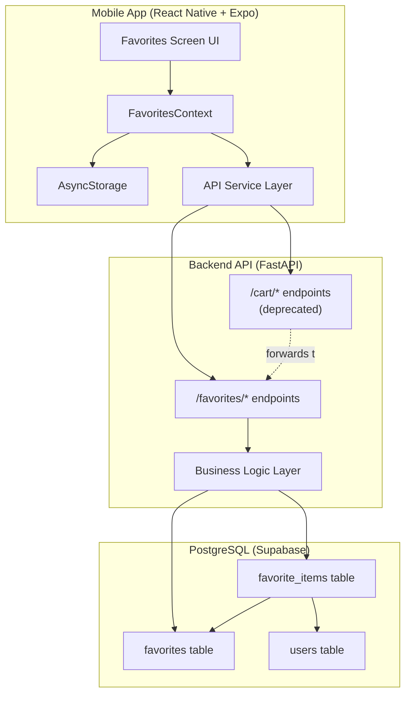
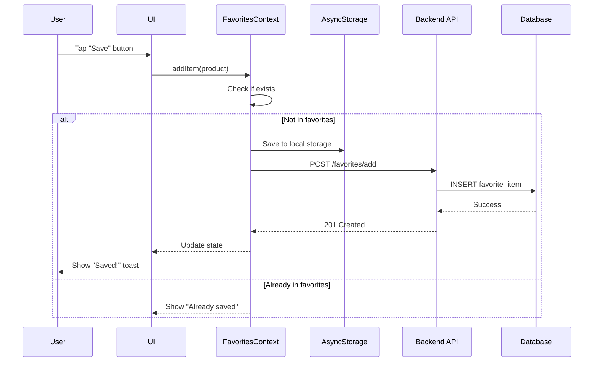
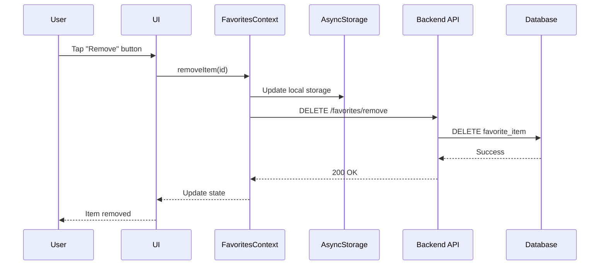
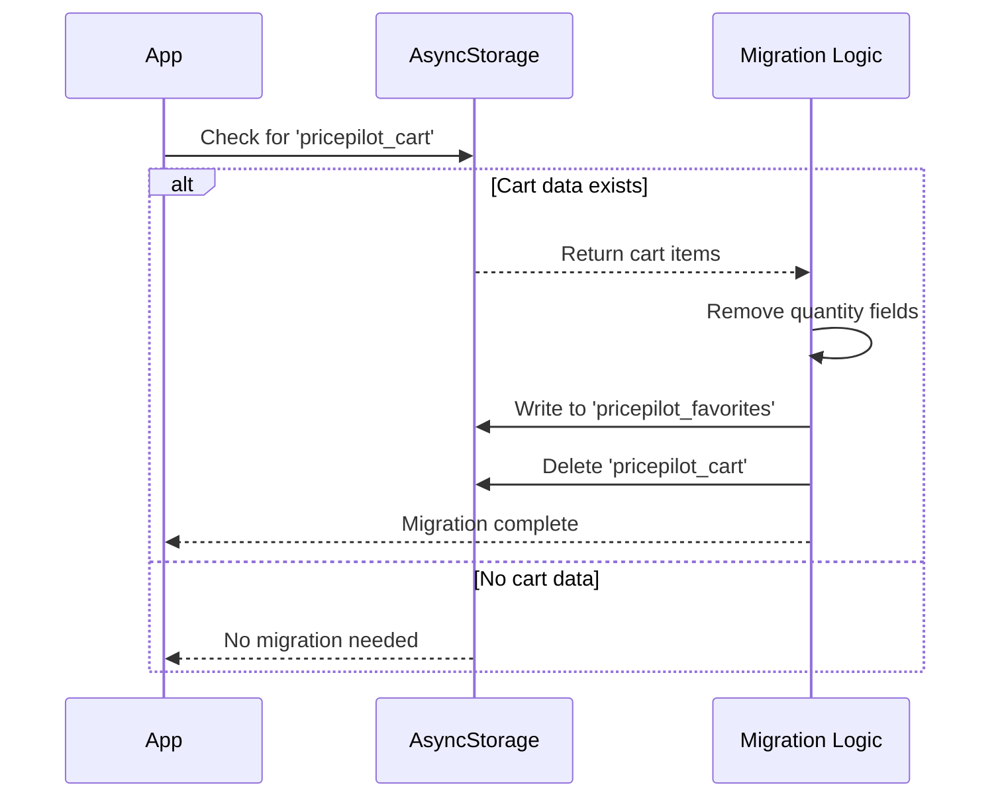

# Technical Design Document: Cart to Favorites Conversion

## Overview

This document provides the technical design for converting the PricePilot shopping cart system to a Favorites/Saved Products feature. PricePilot is a price comparison platform that aggregates product data from multiple stores (Jeevee, Oliz, Daraz, Hukut, Neostore, Hardwarepasal). The current "Shopping Cart" metaphor incorrectly suggests purchasing capability, when users actually save products to compare prices across stores.

### Purpose

Transform the cart system into a favorites system that:
- Reflects the true purpose of the platform (price comparison, not purchasing)
- Removes purchasing-related concepts (quantity, checkout, totals)
- Maintains all existing functionality for saving and viewing products
- Provides seamless data migration for existing users

### Scope

**In Scope:**
- Database table and column renaming (cart → favorites)
- Backend API endpoint renaming (/cart/* → /favorites/*)
- Frontend context and component renaming
- UI terminology and iconography updates
- Removal of quantity management
- Removal of checkout functionality
- Data migration scripts for both database and local storage
- Backward compatibility layer (14-day deprecation period)

**Out of Scope:**
- Price history tracking
- Price drop alerts
- Favorites sharing
- Favorites categories/organization
- Comparison screen implementation (separate feature)

### Architecture Principles

1. **Minimal Breaking Changes**: Maintain backward compatibility during transition period
2. **Data Preservation**: Zero data loss during migration
3. **Atomic Operations**: Database migrations execute in single transactions
4. **Graceful Degradation**: Old app versions continue functioning during deprecation period
5. **Progressive Enhancement**: New features can build on favorites foundation

## Architecture

### System Architecture



### Data Flow

#### Add to Favorites Flow



#### Remove from Favorites Flow



#### Migration Flow (First Launch After Update)



### Technology Stack

#### Mobile Application
- **Framework**: React Native (Expo SDK 54)
- **State Management**: React Context API
- **Local Storage**: @react-native-async-storage/async-storage
- **Navigation**: expo-router
- **Icons**: @expo/vector-icons (Ionicons)
- **Language**: TypeScript

#### Backend API
- **Framework**: FastAPI (Python)
- **Database ORM**: SQLAlchemy
- **Migration Tool**: Alembic
- **Database**: PostgreSQL (hosted on Supabase)
- **Authentication**: JWT Bearer tokens

## Components and Interfaces

### Mobile Components

#### FavoritesContext

**Location**: `mobile/context/FavoritesContext.tsx`

**Responsibilities**:
- Manage favorites state in React context
- Persist favorites to AsyncStorage
- Sync favorites with backend API
- Provide hooks for favorites operations

**Interface**:
```typescript
interface FavoriteItem {
  id: string;              // unique key: `${storeName}-${productUrl}`
  productId?: number;      // from DB if available
  title: string;
  price: number;
  originalPrice?: number;
  discountPercent?: number;
  imageUrl: string;
  storeName: string;
  productUrl: string;
  // quantity removed
}

interface FavoritesContextType {
  items: FavoriteItem[];
  addItem: (item: Omit<FavoriteItem, 'id'>) => void;
  removeItem: (id: string) => void;
  clearFavorites: () => void;
  itemCount: number;
  // updateQuantity removed
  // totalPrice removed
}
```

**State Management**:
```typescript
const [items, setItems] = useState<FavoriteItem[]>([]);
const [loaded, setLoaded] = useState(false);
```

**Key Methods**:
- `addItem`: Adds product to favorites (no quantity)
- `removeItem`: Removes product by id
- `clearFavorites`: Empties favorites list
- `migrateFromCart`: One-time migration from old cart data

#### Favorites Screen

**Location**: `mobile/app/(tabs)/favorites.tsx`

**Responsibilities**:
- Display saved products grouped by store
- Handle add/remove operations
- Show empty state when no favorites
- Provide navigation to product details

**UI Components**:
- Store section headers with logos
- Product cards with image, title, price
- Remove button for each item
- Compare prices button (when 2+ items)
- Empty state illustration

#### API Service Layer

**Location**: `mobile/services/api.ts` (or inline in context)

**Endpoints**:
```typescript
async function addToFavorites(product: FavoriteItem): Promise<void>;
async function removeFromFavorites(id: string): Promise<void>;
async function getFavorites(): Promise<FavoriteItem[]>;
```

### Backend Components

#### Favorites Router

**Location**: `backend/app/routers/favorites.py`

**Endpoints**:
- `POST /favorites/add`: Add product to favorites
- `DELETE /favorites/remove`: Remove product from favorites
- `GET /favorites`: Get user's favorites
- `POST /favorites/clear`: Clear all favorites (optional)

**Authentication**: All endpoints require JWT Bearer token

#### Cart Router (Deprecated)

**Location**: `backend/app/routers/cart.py` (if exists)

**Behavior**: Forward all requests to favorites endpoints with deprecation headers

**Deprecation Headers**:
```
Deprecation: true
Sunset: Wed, 31 Jan 2024 23:59:59 GMT
Link: </favorites/*>; rel="successor-version"
```

#### Database Models

**Location**: `backend/app/models/favorites.py`

**Models**:
```python
class Favorite(Base):
    __tablename__ = "favorites"
    
    id = Column(UUID, primary_key=True, default=uuid4)
    user_id = Column(UUID, ForeignKey("users.id"), nullable=False)
    created_at = Column(DateTime, default=datetime.utcnow)
    updated_at = Column(DateTime, default=datetime.utcnow, onupdate=datetime.utcnow)
    
    items = relationship("FavoriteItem", back_populates="favorite", cascade="all, delete-orphan")
    user = relationship("User", back_populates="favorites")


class FavoriteItem(Base):
    __tablename__ = "favorite_items"
    
    id = Column(UUID, primary_key=True, default=uuid4)
    favorite_id = Column(UUID, ForeignKey("favorites.id"), nullable=False)
    product_id = Column(UUID, nullable=True)
    store_name = Column(String(100), nullable=False)
    product_url = Column(Text, nullable=False)
    product_title = Column(String(500), nullable=False)
    product_image = Column(Text, nullable=True)
    price = Column(Numeric(10, 2), nullable=False)
    added_at = Column(DateTime, default=datetime.utcnow)
    
    favorite = relationship("Favorite", back_populates="items")
    # quantity column removed
```

## Data Models

### Database Schema

#### favorites Table

```sql
CREATE TABLE favorites (
    id          UUID PRIMARY KEY DEFAULT gen_random_uuid(),
    user_id     UUID NOT NULL REFERENCES users(id) ON DELETE CASCADE,
    created_at  TIMESTAMPTZ NOT NULL DEFAULT NOW(),
    updated_at  TIMESTAMPTZ NOT NULL DEFAULT NOW()
);

CREATE INDEX idx_favorites_user ON favorites(user_id);
CREATE INDEX idx_favorites_created ON favorites(created_at);
```

#### favorite_items Table

```sql
CREATE TABLE favorite_items (
    id              UUID PRIMARY KEY DEFAULT gen_random_uuid(),
    favorite_id     UUID NOT NULL REFERENCES favorites(id) ON DELETE CASCADE,
    product_id      UUID,
    store_name      VARCHAR(100) NOT NULL,
    product_url     TEXT NOT NULL,
    product_title   VARCHAR(500) NOT NULL,
    product_image   TEXT,
    price           NUMERIC(10, 2) NOT NULL,
    added_at        TIMESTAMPTZ NOT NULL DEFAULT NOW()
);

CREATE INDEX idx_favorite_items_favorite ON favorite_items(favorite_id);
CREATE INDEX idx_favorite_items_product ON favorite_items(product_id);
CREATE INDEX idx_favorite_items_added ON favorite_items(added_at);
CREATE INDEX idx_favorite_items_store ON favorite_items(store_name);
```

### Migration Schema Changes

The migration will rename existing tables if they exist:
- `shopping_cart` → `favorites`
- `cart_items` → `favorite_items`

And drop the quantity column:
- `ALTER TABLE favorite_items DROP COLUMN IF EXISTS quantity;`

### API Request/Response Models

#### Add to Favorites Request

```json
{
  "product_id": "550e8400-e29b-41d4-a716-446655440000",
  "store_name": "Daraz",
  "product_url": "https://daraz.com.np/products/laptop",
  "product_title": "Dell Inspiron 15 3000 Series",
  "product_image": "https://image.url/laptop.jpg",
  "price": 75000.00
}
```

#### Add to Favorites Response

```json
{
  "success": true,
  "message": "Product added to favorites",
  "favorite_item_id": "660e8400-e29b-41d4-a716-446655440001"
}
```

#### Get Favorites Response

```json
{
  "favorites": [
    {
      "id": "660e8400-e29b-41d4-a716-446655440001",
      "product_id": "550e8400-e29b-41d4-a716-446655440000",
      "store_name": "Daraz",
      "product_url": "https://daraz.com.np/products/laptop",
      "product_title": "Dell Inspiron 15 3000 Series",
      "product_image": "https://image.url/laptop.jpg",
      "price": 75000.00,
      "added_at": "2024-01-15T10:30:00Z"
    }
  ],
  "total_count": 1
}
```


## Correctness Properties

This refactoring primarily involves renaming, removing fields, and updating UI terminology rather than implementing new business logic. The core operations (add, remove, list) remain unchanged. As such, traditional property-based testing has limited applicability since:

1. **No New Algorithms**: We're not implementing new data transformations or complex logic
2. **Schema Changes Only**: Database changes are structural (rename tables/columns, drop quantity)
3. **UI Refactoring**: Most changes are presentational (labels, icons, removing UI elements)
4. **Migration Operations**: One-time data transformations that are better tested with integration tests

However, we can define correctness properties for the key operations that should continue to work correctly:

*A property is a characteristic or behavior that should hold true across all valid executions of a system—essentially, a formal statement about what the system should do. Properties serve as the bridge between human-readable specifications and machine-verifiable correctness guarantees.*

### Property 1: Favorites Addition Idempotence

*For any* valid product, adding the same product to favorites multiple times SHALL result in the product appearing exactly once in the favorites list.

**Validates: Requirements 5.6, 7.1**

**Rationale**: Unlike cart systems that increment quantity on duplicate adds, favorites should maintain uniqueness. Adding a product that already exists should either be rejected or update the existing entry, never create duplicates.

### Property 2: Migration Completeness

*For any* cart item with a quantity field, migrating to favorites SHALL preserve all product data fields (id, title, price, store, url, image) while removing the quantity field, resulting in a valid FavoriteItem.

**Validates: Requirements 13.1-13.7, 14.1-14.7**

**Rationale**: Migration is a one-time critical operation. Every cart item must successfully transform into a favorite item without data loss (except for the intentionally removed quantity field).

### Property 3: Store Grouping Consistency

*For any* set of favorite items, grouping by store name SHALL produce groups where all items in a group have identical storeName values, and no item appears in multiple groups.

**Validates: Requirements 10.1-10.6**

**Rationale**: The UI displays favorites grouped by store. This grouping must be consistent and partition the favorites list correctly (no duplicates across groups, no missing items).

### Property 4: Empty State Invariant

*For any* favorites list, when itemCount equals 0, the UI SHALL display the empty state view and disable the "Compare Prices" button.

**Validates: Requirements 6.7, 11.2**

**Rationale**: Empty state handling must be consistent. When no favorites exist, certain UI elements must be hidden/disabled.

### Property 5: API Backward Compatibility During Deprecation

*For any* valid cart endpoint request (POST /cart/add, DELETE /cart/remove, GET /cart) made during the 14-day deprecation period, the backend SHALL return the same successful response (2xx status code) as the equivalent favorites endpoint.

**Validates: Requirements 2.10, NFR1.1-NFR1.5**

**Rationale**: Old app versions must continue functioning during the transition period. Deprecated endpoints must forward to new endpoints transparently.

## Error Handling

### Mobile App Error Handling

#### Network Errors

**Scenario**: API requests fail due to network issues

**Handling**:
- Display toast message: "Could not connect. Check your internet connection."
- Maintain optimistic UI updates (show changes immediately)
- Keep local AsyncStorage as source of truth
- Retry failed operations on next app launch or manual sync

**Code Pattern**:
```typescript
try {
  await api.addToFavorites(item);
} catch (error) {
  if (error.message.includes('network')) {
    showToast('Could not sync with server. Changes saved locally.');
  } else {
    showToast('Failed to add to favorites. Please try again.');
  }
}
```

#### Authentication Errors

**Scenario**: JWT token expired or invalid

**Handling**:
- Catch 401 Unauthorized responses
- Clear invalid token from storage
- Redirect to login screen
- Preserve favorites in AsyncStorage for post-login sync

#### Duplicate Add Errors

**Scenario**: User attempts to add product already in favorites

**Handling**:
- Backend returns 409 Conflict
- Mobile shows toast: "This product is already in your favorites"
- Update UI to show filled heart icon
- No error logged (expected behavior)

#### Remove Non-Existent Item Errors

**Scenario**: Attempting to remove item that doesn't exist

**Handling**:
- Backend returns 404 Not Found
- Mobile removes from local state anyway (optimistic)
- Log warning for debugging
- No user-visible error (item is gone, which was the goal)

### Backend Error Handling

#### Database Connection Errors

**Scenario**: PostgreSQL database unavailable

**Handling**:
```python
@router.post("/favorites/add")
async def add_to_favorites(request: AddFavoriteRequest, db: Session = Depends(get_db)):
    try:
        # Database operations
        return {"success": True, "message": "Product added to favorites"}
    except SQLAlchemyError as e:
        logger.error(f"Database error: {e}")
        raise HTTPException(status_code=503, detail="Service temporarily unavailable")
    except Exception as e:
        logger.error(f"Unexpected error: {e}")
        raise HTTPException(status_code=500, detail="Internal server error")
```

#### Invalid Request Data

**Scenario**: Missing required fields or invalid data types

**Handling**:
- Pydantic validation automatically rejects invalid requests
- Return 422 Unprocessable Entity with validation errors
- Example: `{"detail": [{"loc": ["body", "price"], "msg": "field required", "type": "value_error.missing"}]}`

#### User Not Found

**Scenario**: JWT token valid but user_id doesn't exist in database

**Handling**:
- Return 401 Unauthorized
- Log incident (potential security issue)
- Force re-authentication

#### Duplicate Favorite

**Scenario**: User tries to add product already in favorites

**Handling**:
```python
existing = db.query(FavoriteItem).filter(
    FavoriteItem.favorite_id == favorite.id,
    FavoriteItem.product_url == request.product_url,
    FavoriteItem.store_name == request.store_name
).first()

if existing:
    raise HTTPException(status_code=409, detail="Product already in favorites")
```

### Migration Error Handling

#### Database Migration Errors

**Scenario**: Migration script encounters errors during table rename

**Handling**:
```python
try:
    with engine.begin() as connection:
        # Check if tables exist
        # Rename tables
        # Drop quantity column
        # Verify row counts
        connection.commit()
        logger.info("Migration completed successfully")
except Exception as e:
    connection.rollback()
    logger.error(f"Migration failed: {e}")
    logger.info("All changes rolled back")
    raise
```

**Recovery**: Restore from backup created before migration

#### Mobile Storage Migration Errors

**Scenario**: AsyncStorage read/write fails during migration

**Handling**:
```typescript
async function migrateCartToFavorites() {
  try {
    const cartData = await AsyncStorage.getItem('pricepilot_cart');
    if (!cartData) return; // No migration needed
    
    const cartItems = JSON.parse(cartData);
    const favoriteItems = cartItems.map(item => {
      const { quantity, ...rest } = item; // Remove quantity
      return rest;
    });
    
    await AsyncStorage.setItem('pricepilot_favorites', JSON.stringify(favoriteItems));
    await AsyncStorage.removeItem('pricepilot_cart');
    
    console.log('Migration successful');
  } catch (error) {
    console.error('Migration failed, will retry on next launch:', error);
    // Keep old cart data for retry
  }
}
```

**Recovery**: Retry on next app launch (migration is idempotent)

### Validation Rules

#### Product Data Validation

**Frontend Validation**:
- title: non-empty string, max 500 characters
- price: positive number > 0
- storeName: non-empty string, max 100 characters
- productUrl: valid URL format
- imageUrl: valid URL format (optional)

**Backend Validation**:
```python
class AddFavoriteRequest(BaseModel):
    product_id: Optional[UUID]
    store_name: constr(min_length=1, max_length=100)
    product_url: HttpUrl
    product_title: constr(min_length=1, max_length=500)
    product_image: Optional[HttpUrl]
    price: condecimal(gt=0, max_digits=10, decimal_places=2)
```

## Testing Strategy

### Overview

Since this is primarily a refactoring project involving renaming and schema changes rather than new business logic, the testing strategy focuses on:

1. **Integration Tests**: Verify database migrations work correctly
2. **Unit Tests**: Ensure renamed components function identically
3. **E2E Tests**: Validate complete user flows work after changes
4. **Manual Testing**: Verify UI changes and user experience

Property-based testing is less applicable here because:
- We're not implementing new algorithms or transformations
- Most changes are structural (renames) rather than behavioral
- The core add/remove/list logic remains unchanged

### Unit Tests

#### Mobile App Unit Tests

**FavoritesContext Tests** (`mobile/context/__tests__/FavoritesContext.test.tsx`):

```typescript
describe('FavoritesContext', () => {
  test('addItem adds product without quantity field', () => {
    const { result } = renderHook(() => useFavorites());
    const product = { id: '1', title: 'Test', price: 100, storeName: 'Store', productUrl: 'url', imageUrl: 'img' };
    
    act(() => result.current.addItem(product));
    
    expect(result.current.items[0]).not.toHaveProperty('quantity');
  });
  
  test('addItem prevents duplicate products', () => {
    const { result } = renderHook(() => useFavorites());
    const product = { id: '1', title: 'Test', price: 100, storeName: 'Store', productUrl: 'url', imageUrl: 'img' };
    
    act(() => {
      result.current.addItem(product);
      result.current.addItem(product);
    });
    
    expect(result.current.items.length).toBe(1);
  });
  
  test('removeItem removes product from favorites', () => {
    const { result } = renderHook(() => useFavorites());
    const product = { id: '1', title: 'Test', price: 100, storeName: 'Store', productUrl: 'url', imageUrl: 'img' };
    
    act(() => {
      result.current.addItem(product);
      result.current.removeItem('1');
    });
    
    expect(result.current.items.length).toBe(0);
  });
  
  test('migrateFromCart removes quantity field', async () => {
    const cartData = [{ id: '1', title: 'Test', price: 100, quantity: 3 }];
    await AsyncStorage.setItem('pricepilot_cart', JSON.stringify(cartData));
    
    const { result } = renderHook(() => useFavorites());
    await waitFor(() => expect(result.current.items.length).toBe(1));
    
    expect(result.current.items[0]).not.toHaveProperty('quantity');
  });
});
```

**API Service Tests** (`mobile/services/__tests__/api.test.ts`):

```typescript
describe('Favorites API', () => {
  test('addToFavorites calls correct endpoint', async () => {
    fetchMock.postOnce('/api/favorites/add', { success: true });
    
    await addToFavorites({ title: 'Test', price: 100 });
    
    expect(fetchMock).toHaveBeenCalledWith('/api/favorites/add', expect.any(Object));
  });
  
  test('getFavorites returns favorites without quantity', async () => {
    fetchMock.getOnce('/api/favorites', { favorites: [{ id: '1', title: 'Test', price: 100 }] });
    
    const result = await getFavorites();
    
    expect(result[0]).not.toHaveProperty('quantity');
  });
});
```

#### Backend Unit Tests

**Favorites Router Tests** (`backend/app/routers/test_favorites.py`):

```python
def test_add_to_favorites_success(client, auth_headers):
    """Test successful product addition to favorites"""
    payload = {
        "store_name": "Daraz",
        "product_url": "https://daraz.com.np/product",
        "product_title": "Test Product",
        "price": 99.99
    }
    
    response = client.post("/favorites/add", json=payload, headers=auth_headers)
    
    assert response.status_code == 201
    assert response.json()["success"] == True
    assert "favorite_item_id" in response.json()


def test_add_duplicate_favorite_returns_409(client, auth_headers):
    """Test adding duplicate product returns 409 Conflict"""
    payload = {
        "store_name": "Daraz",
        "product_url": "https://daraz.com.np/product",
        "product_title": "Test Product",
        "price": 99.99
    }
    
    client.post("/favorites/add", json=payload, headers=auth_headers)
    response = client.post("/favorites/add", json=payload, headers=auth_headers)
    
    assert response.status_code == 409


def test_remove_favorite_success(client, auth_headers, favorite_item_id):
    """Test successful removal of favorite"""
    response = client.delete(
        "/favorites/remove",
        json={"favorite_item_id": favorite_item_id},
        headers=auth_headers
    )
    
    assert response.status_code == 200
    assert response.json()["success"] == True


def test_get_favorites_returns_list(client, auth_headers):
    """Test retrieving user's favorites"""
    response = client.get("/favorites", headers=auth_headers)
    
    assert response.status_code == 200
    assert "favorites" in response.json()
    assert isinstance(response.json()["favorites"], list)
    assert "total_count" in response.json()
```

**Deprecated Cart Endpoint Tests**:

```python
def test_deprecated_cart_add_forwards_to_favorites(client, auth_headers):
    """Test deprecated /cart/add forwards to /favorites/add"""
    payload = {"store_name": "Daraz", "product_url": "url", "product_title": "Test", "price": 99.99}
    
    response = client.post("/cart/add", json=payload, headers=auth_headers)
    
    assert response.status_code == 201
    assert response.headers.get("Deprecation") == "true"
    assert "successor-version" in response.headers.get("Link", "")


def test_deprecated_cart_endpoints_return_410_after_sunset(client, auth_headers):
    """Test deprecated endpoints return 410 after deprecation period"""
    # Simulate time after sunset date
    with freeze_time("2024-02-01"):
        response = client.get("/cart", headers=auth_headers)
        assert response.status_code == 410
```

### Integration Tests

#### Database Migration Tests

**Migration Script Tests** (`backend/tests/test_migration.py`):

```python
def test_migration_renames_tables_correctly():
    """Test migration successfully renames cart tables to favorites"""
    # Setup: Create cart tables with sample data
    setup_cart_tables_with_data()
    
    # Execute migration
    run_migration_script()
    
    # Verify: favorites tables exist, cart tables don't
    assert table_exists("favorites")
    assert table_exists("favorite_items")
    assert not table_exists("shopping_cart")
    assert not table_exists("cart_items")


def test_migration_preserves_data():
    """Test migration preserves all user data"""
    # Setup: Create 100 cart items for 10 users
    original_data = setup_cart_data(users=10, items_per_user=10)
    
    # Execute migration
    run_migration_script()
    
    # Verify: All data exists in favorites tables
    migrated_data = get_all_favorite_items()
    assert len(migrated_data) == 100
    
    # Verify: Each item maintains all fields except quantity
    for original, migrated in zip(original_data, migrated_data):
        assert migrated.product_title == original.product_title
        assert migrated.price == original.price
        assert migrated.store_name == original.store_name
        assert not hasattr(migrated, 'quantity')


def test_migration_rolls_back_on_error():
    """Test migration rolls back all changes on error"""
    setup_cart_tables_with_data()
    
    # Inject error during migration
    with patch('migration.rename_table', side_effect=Exception("DB Error")):
        with pytest.raises(Exception):
            run_migration_script()
    
    # Verify: Original tables still exist
    assert table_exists("shopping_cart")
    assert table_exists("cart_items")
    assert not table_exists("favorites")
```

#### End-to-End Tests

**Mobile E2E Tests** (`mobile/e2e/favorites.e2e.ts`):

```typescript
describe('Favorites E2E', () => {
  beforeEach(async () => {
    await device.reloadReactNative();
    await element(by.id('login-email')).typeText('test@example.com');
    await element(by.id('login-password')).typeText('password');
    await element(by.id('login-submit')).tap();
  });
  
  it('should add product to favorites from product detail page', async () => {
    await element(by.id('product-card-0')).tap();
    await element(by.id('add-to-favorites-btn')).tap();
    
    await expect(element(by.text('Added to Favorites!'))).toBeVisible();
    
    await element(by.id('nav-favorites')).tap();
    await expect(element(by.id('favorite-item-0'))).toBeVisible();
  });
  
  it('should remove product from favorites', async () => {
    await element(by.id('nav-favorites')).tap();
    await element(by.id('remove-favorite-0')).tap();
    
    await expect(element(by.id('favorite-item-0'))).not.toBeVisible();
  });
  
  it('should display empty state when no favorites', async () => {
    await element(by.id('nav-favorites')).tap();
    
    await expect(element(by.text('Your favorites list is empty'))).toBeVisible();
    await expect(element(by.id('empty-heart-icon'))).toBeVisible();
  });
  
  it('should group favorites by store', async () => {
    await element(by.id('nav-favorites')).tap();
    
    await expect(element(by.text('Daraz'))).toBeVisible();
    await expect(element(by.text('Oliz'))).toBeVisible();
    await expect(element(by.id('store-section-Daraz'))).toBeVisible();
  });
});
```

### Manual Testing Checklist

#### Pre-Migration Testing (Current Cart System)

- [ ] Verify current cart has items saved
- [ ] Take screenshot of current cart contents
- [ ] Export cart data for comparison
- [ ] Verify quantities are displayed
- [ ] Verify checkout button exists

#### Post-Migration Testing (New Favorites System)

**Database Verification**:
- [ ] Verify `favorites` table exists
- [ ] Verify `favorite_items` table exists
- [ ] Verify all user data migrated (row count matches)
- [ ] Verify `quantity` column removed
- [ ] Verify foreign key relationships intact

**Backend API Testing**:
- [ ] Test POST /favorites/add with valid data → 201
- [ ] Test POST /favorites/add with duplicate → 409
- [ ] Test GET /favorites → 200 with items list
- [ ] Test DELETE /favorites/remove → 200
- [ ] Test deprecated POST /cart/add → forwards to favorites
- [ ] Test deprecated endpoints after sunset → 410

**Mobile App Testing**:
- [ ] Open app after update → migration runs automatically
- [ ] Verify old cart items appear in favorites
- [ ] Verify no quantity displayed
- [ ] Verify "Save" button instead of "Add to Cart"
- [ ] Verify heart icon instead of cart icon
- [ ] Verify no checkout button
- [ ] Verify no total price displayed
- [ ] Verify stores grouped correctly
- [ ] Verify "Compare Prices" button appears (when 2+ items)
- [ ] Test add product → appears in favorites
- [ ] Test remove product → disappears from favorites
- [ ] Test empty state displays correctly

**Cross-Platform Testing**:
- [ ] Test on iOS device
- [ ] Test on Android device
- [ ] Test on different screen sizes
- [ ] Test with screen reader (accessibility)

### Performance Testing

**Load Testing**:
- Test GET /favorites with 100+ items per user
- Target: Response time < 500ms
- Test concurrent add/remove operations
- Verify database indexes are used (EXPLAIN ANALYZE)

**Mobile Performance**:
- Test favorites screen render time with 50+ items
- Target: < 200ms initial render
- Test scroll performance
- Target: 60 FPS scrolling

### Test Coverage Goals

- **Backend**: 90% code coverage for favorites router
- **Mobile**: 85% code coverage for FavoritesContext
- **Migration Script**: 100% coverage with integration tests
- **E2E**: Cover critical user flows (add, remove, view)

### Continuous Integration

**Pre-Merge Checks**:
1. All unit tests pass
2. Integration tests pass
3. E2E tests pass (on both iOS and Android simulators)
4. Linting passes
5. TypeScript compilation succeeds
6. No console errors in test runs

**Staging Deployment**:
1. Run migration on staging database copy
2. Verify data integrity
3. Run full E2E test suite
4. Manual smoke testing
5. Performance benchmarking

**Production Deployment**:
1. Database backup created
2. Migration runs during low-traffic window
3. Monitor error logs
4. Monitor API response times
5. Monitor deprecated endpoint usage
6. Rollback plan ready if issues detected


## Implementation Guidance

### Implementation Phases

#### Phase 1: Database Migration (Backend)

**Objective**: Update database schema without breaking existing functionality

**Steps**:
1. Create migration script (`backend/migrations/rename_cart_to_favorites.py`)
2. Test migration on database copy
3. Create database backup
4. Run migration during low-traffic window (3 AM - 5 AM local time)
5. Verify data integrity post-migration
6. Update SQLAlchemy models to reflect new table names

**Rollback Plan**: 
- Keep backup for 30 days
- Reverse migration script available
- Can restore from backup in < 5 minutes

#### Phase 2: Backend API Updates

**Objective**: Create new favorites endpoints and maintain deprecated cart endpoints

**Steps**:
1. Create `backend/app/routers/favorites.py` with new endpoints
2. Implement `/favorites/add`, `/favorites/remove`, `/favorites` endpoints
3. Update models in `backend/app/models/favorites.py`
4. Add deprecation layer to forward `/cart/*` requests
5. Add deprecation headers to cart endpoint responses
6. Update API documentation (OpenAPI/Swagger)
7. Write unit tests for all new endpoints
8. Write integration tests for backward compatibility

**Success Criteria**:
- All favorites endpoints return correct responses
- Deprecated cart endpoints forward successfully
- 90% test coverage achieved
- API documentation updated

#### Phase 3: Mobile Context Refactoring

**Objective**: Rename context and remove quantity management

**Steps**:
1. Create `mobile/context/FavoritesContext.tsx` (copy of CartContext)
2. Update interface: `CartItem` → `FavoriteItem`, remove `quantity` field
3. Remove `updateQuantity` method
4. Remove `totalPrice` calculation
5. Update `addItem` to not increment quantity
6. Add `migrateFromCart` function for local storage migration
7. Update storage key: `'pricepilot_cart'` → `'pricepilot_favorites'`
8. Update all import statements throughout the app
9. Write unit tests for FavoritesContext
10. Verify AsyncStorage migration works

**Files to Update**:
- `mobile/context/CartContext.tsx` → `FavoritesContext.tsx`
- `mobile/app/_layout.tsx` (provider import)
- All files importing `useCart` hook

#### Phase 4: Mobile Screen Updates

**Objective**: Update cart screen to favorites screen with new UI

**Steps**:
1. Rename `mobile/app/(tabs)/cart.tsx` → `favorites.tsx`
2. Update navigation configuration:
   - Tab label: "Cart" → "Favorites"
   - Tab icon: "cart" → "heart"
3. Update screen header: "Shopping Cart" → "Favorites"
4. Remove quantity controls (+/- buttons)
5. Remove checkbox selection UI
6. Remove "Select All" functionality
7. Remove "Check Out" button
8. Remove subtotal display
9. Add item count display: "X items saved"
10. Add "Compare Prices" button (enabled when 2+ items)
11. Update empty state:
    - Icon: "cart-outline" → "heart-outline"
    - Message: "Your favorites list is empty"
    - Subtitle: "Save products to compare prices later"

**UI Component Updates**:
- Remove `Checkbox` component
- Remove `quantityControls` component
- Update `bottomSummary` to show item count and compare button
- Maintain store grouping layout

#### Phase 5: Mobile API Integration

**Objective**: Update API calls to use new favorites endpoints

**Steps**:
1. Update `addToCart` → `addToFavorites` (remove quantity parameter)
2. Update `removeFromCart` → `removeFromFavorites`
3. Update `getCart` → `getFavorites`
4. Update API URLs: `/cart/*` → `/favorites/*`
5. Handle 410 Gone responses from deprecated endpoints
6. Add retry logic for failed migrations
7. Test error handling flows

#### Phase 6: UI Component Updates

**Objective**: Update all "Add to Cart" buttons to "Save" or "Add to Favorites"

**Files to Update**:
- Product detail screens
- DealCard components
- Featured products
- Search results
- Any other components with "Add to Cart" buttons

**Changes**:
- Button text: "Add to Cart" → "Save" or "Add to Favorites"
- Button icon: "cart-outline" → "heart-outline" or "bookmark-outline"
- Filled icon when already favorited: "heart" or "bookmark"
- Toast message: "Added to cart!" → "Saved!" or "Added to Favorites!"

#### Phase 7: Testing & QA

**Objective**: Comprehensive testing before production deployment

**Steps**:
1. Run all unit tests (backend + mobile)
2. Run integration tests
3. Run E2E tests on iOS and Android
4. Manual testing on physical devices
5. Performance testing (API response times, mobile render times)
6. Accessibility testing with screen reader
7. Cross-platform testing (different screen sizes)
8. Backward compatibility testing (old endpoints)

#### Phase 8: Deployment

**Objective**: Roll out changes to production safely

**Steps**:
1. Deploy backend changes first
2. Monitor deprecated endpoint usage
3. Deploy mobile app update (gradual rollout: 10% → 50% → 100%)
4. Monitor error rates and crash reports
5. Monitor API performance metrics
6. Collect user feedback
7. After 14 days, return 410 Gone for deprecated endpoints

### Migration Procedures

#### Database Migration Script

**File**: `backend/migrations/rename_cart_to_favorites.py`

```python
import sys
from sqlalchemy import create_engine, text, inspect
from sqlalchemy.exc import SQLAlchemyError
import logging
from datetime import datetime
import os
from dotenv import load_dotenv

# Configure logging
logging.basicConfig(
    level=logging.INFO,
    format='%(asctime)s - %(levelname)s - %(message)s',
    handlers=[
        logging.FileHandler('migration.log'),
        logging.StreamHandler()
    ]
)
logger = logging.getLogger(__name__)

load_dotenv()
DATABASE_URL = os.getenv("DATABASE_URL")

def backup_tables(engine):
    """Create backup tables before migration"""
    try:
        with engine.connect() as conn:
            logger.info("Creating backup tables...")
            
            # Backup cart tables
            conn.execute(text("CREATE TABLE shopping_cart_backup AS SELECT * FROM shopping_cart"))
            conn.execute(text("CREATE TABLE cart_items_backup AS SELECT * FROM cart_items"))
            conn.commit()
            
            logger.info("Backup tables created successfully")
            return True
    except Exception as e:
        logger.error(f"Backup failed: {e}")
        return False


def check_tables_exist(engine):
    """Check if cart tables exist"""
    inspector = inspect(engine)
    tables = inspector.get_table_names()
    
    has_cart = "shopping_cart" in tables
    has_items = "cart_items" in tables
    
    logger.info(f"shopping_cart exists: {has_cart}")
    logger.info(f"cart_items exists: {has_items}")
    
    return has_cart, has_items


def get_row_counts(engine):
    """Get row counts for verification"""
    with engine.connect() as conn:
        cart_count = conn.execute(text("SELECT COUNT(*) FROM shopping_cart")).scalar()
        items_count = conn.execute(text("SELECT COUNT(*) FROM cart_items")).scalar()
    
    logger.info(f"Current row counts - shopping_cart: {cart_count}, cart_items: {items_count}")
    return cart_count, items_count


def rename_tables_and_columns(engine):
    """Execute the migration in a transaction"""
    try:
        with engine.begin() as conn:
            logger.info("Starting migration transaction...")
            
            # Rename tables
            logger.info("Renaming shopping_cart to favorites...")
            conn.execute(text("ALTER TABLE shopping_cart RENAME TO favorites"))
            
            logger.info("Renaming cart_items to favorite_items...")
            conn.execute(text("ALTER TABLE cart_items RENAME TO favorite_items"))
            
            # Update foreign key constraint name if needed
            logger.info("Renaming foreign key constraint...")
            conn.execute(text("""
                ALTER TABLE favorite_items 
                RENAME CONSTRAINT cart_items_cart_id_fkey 
                TO favorite_items_favorite_id_fkey
            """))
            
            # Rename column in favorite_items
            logger.info("Renaming cart_id to favorite_id...")
            conn.execute(text("""
                ALTER TABLE favorite_items 
                RENAME COLUMN cart_id TO favorite_id
            """))
            
            # Drop quantity column if it exists
            logger.info("Dropping quantity column...")
            conn.execute(text("""
                ALTER TABLE favorite_items 
                DROP COLUMN IF EXISTS quantity
            """))
            
            # Update index names
            logger.info("Renaming indexes...")
            conn.execute(text("""
                ALTER INDEX idx_cart_items_cart_id 
                RENAME TO idx_favorite_items_favorite_id
            """))
            
            logger.info("Migration transaction completed successfully")
            return True
            
    except SQLAlchemyError as e:
        logger.error(f"Migration failed: {e}")
        logger.info("Transaction rolled back automatically")
        return False


def verify_migration(engine):
    """Verify migration was successful"""
    try:
        with engine.connect() as conn:
            # Check new tables exist
            inspector = inspect(engine)
            tables = inspector.get_table_names()
            
            assert "favorites" in tables, "favorites table not found"
            assert "favorite_items" in tables, "favorite_items table not found"
            
            # Verify row counts
            favorites_count = conn.execute(text("SELECT COUNT(*) FROM favorites")).scalar()
            items_count = conn.execute(text("SELECT COUNT(*) FROM favorite_items")).scalar()
            
            logger.info(f"Post-migration row counts - favorites: {favorites_count}, favorite_items: {items_count}")
            
            # Verify quantity column doesn't exist
            columns = [col['name'] for col in inspector.get_columns('favorite_items')]
            assert 'quantity' not in columns, "quantity column still exists"
            assert 'favorite_id' in columns, "favorite_id column not found"
            
            logger.info("Migration verification successful")
            return True
            
    except Exception as e:
        logger.error(f"Verification failed: {e}")
        return False


def main():
    """Main migration execution"""
    logger.info("=== Cart to Favorites Migration Started ===")
    logger.info(f"Timestamp: {datetime.now()}")
    
    try:
        # Create engine
        engine = create_engine(DATABASE_URL)
        logger.info("Database connection established")
        
        # Check if tables exist
        has_cart, has_items = check_tables_exist(engine)
        
        if not has_cart and not has_items:
            logger.info("Cart tables do not exist. Creating new favorites tables...")
            # Run create_favorites_tables script instead
            logger.info("Migration not needed - tables will be created fresh")
            return 0
        
        # Get initial row counts
        initial_cart_count, initial_items_count = get_row_counts(engine)
        
        # Create backups
        if not backup_tables(engine):
            logger.error("Backup failed. Aborting migration.")
            return 1
        
        # Execute migration
        if not rename_tables_and_columns(engine):
            logger.error("Migration failed. Check logs and restore from backup.")
            return 1
        
        # Verify migration
        if not verify_migration(engine):
            logger.error("Verification failed. Check data integrity.")
            return 1
        
        logger.info(f"=== Migration Completed Successfully ===")
        logger.info(f"Migrated {initial_cart_count} users with {initial_items_count} total favorites")
        return 0
        
    except Exception as e:
        logger.error(f"Fatal error: {e}")
        return 1


if __name__ == "__main__":
    sys.exit(main())
```

**Usage**:
```bash
cd backend
python migrations/rename_cart_to_favorites.py
```

#### Mobile Storage Migration

**Implementation in FavoritesContext.tsx**:

```typescript
const CART_STORAGE_KEY = 'pricepilot_cart';
const FAVORITES_STORAGE_KEY = 'pricepilot_favorites';

async function migrateCartToFavorites(): Promise<void> {
  try {
    console.log('Checking for cart data to migrate...');
    
    // Check if already migrated
    const favoritesData = await AsyncStorage.getItem(FAVORITES_STORAGE_KEY);
    if (favoritesData) {
      console.log('Favorites data already exists, skipping migration');
      return;
    }
    
    // Check for old cart data
    const cartData = await AsyncStorage.getItem(CART_STORAGE_KEY);
    if (!cartData) {
      console.log('No cart data to migrate');
      return;
    }
    
    // Parse cart data
    const cartItems: CartItem[] = JSON.parse(cartData);
    console.log(`Found ${cartItems.length} cart items to migrate`);
    
    // Transform to favorites (remove quantity)
    const favoriteItems: FavoriteItem[] = cartItems.map(item => {
      const { quantity, ...rest } = item;
      return rest as FavoriteItem;
    });
    
    // Write to favorites storage
    await AsyncStorage.setItem(FAVORITES_STORAGE_KEY, JSON.stringify(favoriteItems));
    console.log('Successfully wrote favorites data');
    
    // Remove old cart data
    await AsyncStorage.removeItem(CART_STORAGE_KEY);
    console.log('Migration completed successfully');
    
    // Log migration event (optional analytics)
    logMigrationEvent(favoriteItems.length);
    
  } catch (error) {
    console.error('Migration failed:', error);
    // Don't throw - will retry on next launch
    // Keep old cart data for retry
  }
}

// Call in FavoritesProvider useEffect
useEffect(() => {
  (async () => {
    try {
      // Run migration first
      await migrateCartToFavorites();
      
      // Then load favorites
      const raw = await AsyncStorage.getItem(FAVORITES_STORAGE_KEY);
      if (raw) {
        setItems(JSON.parse(raw));
      }
    } catch (e) {
      console.error('Failed to load favorites:', e);
    } finally {
      setLoaded(true);
    }
  })();
}, []);
```

### Code Organization

#### Backend Structure

```
backend/
├── app/
│   ├── routers/
│   │   ├── favorites.py          # New favorites endpoints
│   │   ├── cart.py                # Deprecated, forwards to favorites
│   │   └── __init__.py
│   ├── models/
│   │   ├── favorites.py           # Favorite and FavoriteItem models
│   │   └── __init__.py
│   ├── schemas/
│   │   ├── favorites.py           # Pydantic schemas for requests/responses
│   │   └── __init__.py
│   └── services/
│       ├── favorites_service.py   # Business logic for favorites
│       └── __init__.py
├── migrations/
│   ├── rename_cart_to_favorites.py
│   └── create_favorites_tables.py
└── tests/
    ├── test_favorites.py
    ├── test_migration.py
    └── test_deprecated_cart.py
```

#### Mobile Structure

```
mobile/
├── app/
│   └── (tabs)/
│       ├── favorites.tsx          # Main favorites screen (renamed from cart.tsx)
│       └── _layout.tsx            # Tab navigation (update icon and label)
├── context/
│   ├── FavoritesContext.tsx       # Main context (renamed from CartContext.tsx)
│   └── __tests__/
│       └── FavoritesContext.test.tsx
├── components/
│   ├── FavoriteButton.tsx         # "Save" button component
│   ├── FavoriteItem.tsx           # Individual favorite item card
│   └── EmptyFavorites.tsx         # Empty state component
├── services/
│   └── favoritesApi.ts            # API calls for favorites
└── types/
    └── favorites.ts               # TypeScript interfaces
```

### Configuration Updates

#### Backend Environment Variables

No new environment variables needed. Existing `DATABASE_URL` works with renamed tables.

#### Mobile Configuration

Update `mobile/app/(tabs)/_layout.tsx`:

```typescript
<Tabs.Screen
  name="favorites"  // Changed from "cart"
  options={{
    title: 'Favorites',  // Changed from "Cart"
    tabBarIcon: ({ color, focused }) => (
      <Ionicons
        name={focused ? 'heart' : 'heart-outline'}  // Changed from cart/cart-outline
        size={24}
        color={color}
      />
    ),
  }}
/>
```

### Monitoring and Observability

#### Metrics to Track

**Backend Metrics**:
- `/favorites/*` endpoint response times
- `/cart/*` endpoint usage (should decline to zero)
- Error rates for favorites operations
- Database query performance
- Migration success/failure rate

**Mobile Metrics**:
- AsyncStorage migration success rate
- Favorites screen load time
- Add/remove operation latency
- Crash rate (watch for migration-related crashes)
- User engagement with favorites feature

#### Logging

**Backend Logging**:
```python
# Log deprecated endpoint usage
logger.warning(f"Deprecated endpoint /cart/add called by user {user_id}")

# Log migration events
logger.info(f"Migration completed: {cart_count} users, {items_count} items")

# Log favorites operations
logger.info(f"User {user_id} added product to favorites: {product_id}")
```

**Mobile Logging**:
```typescript
// Log migration
console.log(`Migration: Converted ${cartItems.length} cart items to favorites`);

// Log favorites operations
console.log(`Added to favorites: ${product.title} from ${product.storeName}`);
```

#### Alerts

Set up alerts for:
- Migration failure rate > 1%
- Favorites API error rate > 5%
- Deprecated endpoint usage > 10% after 7 days
- Database query time > 1 second
- Mobile crash rate increase > 0.5%

### Rollback Strategy

#### Database Rollback

If issues detected within 24 hours:

```sql
-- Restore from backup
DROP TABLE IF EXISTS favorites CASCADE;
DROP TABLE IF EXISTS favorite_items CASCADE;

CREATE TABLE favorites AS SELECT * FROM shopping_cart_backup;
CREATE TABLE favorite_items AS SELECT * FROM cart_items_backup;

-- Restore foreign keys and indexes
ALTER TABLE favorite_items 
ADD CONSTRAINT favorite_items_favorite_id_fkey 
FOREIGN KEY (favorite_id) REFERENCES favorites(id);

CREATE INDEX idx_favorites_user ON favorites(user_id);
CREATE INDEX idx_favorite_items_favorite ON favorite_items(favorite_id);
```

#### Mobile Rollback

If critical issues in mobile app:
1. Stop app store rollout at current percentage
2. Deploy hotfix reverting FavoritesContext to CartContext
3. Keep migration logic to handle users who already migrated
4. Resume rollout after fix validated

#### Backend Rollback

If API issues detected:
1. Re-enable cart endpoints (remove deprecation)
2. Keep favorites endpoints as aliases
3. Investigate root cause
4. Fix issues before re-attempting deprecation

### Security Considerations

#### Authentication

- All favorites endpoints require JWT authentication
- Verify user_id from token matches requested favorites
- Rate limit favorites operations (max 100/hour per user)

#### Data Validation

- Validate product URLs are from known stores only
- Sanitize product titles and image URLs
- Validate price is positive decimal
- Check maximum favorites per user (e.g., 500 items)

#### SQL Injection Prevention

- Use parameterized queries (SQLAlchemy ORM handles this)
- Never construct SQL with string concatenation
- Validate UUID formats for IDs

#### XSS Prevention

- Sanitize product titles before display
- Validate image URLs are HTTPS
- Use React's built-in XSS protection (never use dangerouslySetInnerHTML)


## Deployment Plan

### Pre-Deployment Checklist

#### Code Review
- [ ] All code changes reviewed by at least 2 team members
- [ ] Design document approved by tech lead and product manager
- [ ] Security review completed
- [ ] Database migration script reviewed by DBA or senior developer

#### Testing Verification
- [ ] All unit tests pass (100% success rate)
- [ ] Integration tests pass
- [ ] E2E tests pass on iOS and Android
- [ ] Manual testing completed on physical devices
- [ ] Performance benchmarks meet targets
- [ ] Accessibility testing completed
- [ ] Migration script tested on database copy

#### Documentation
- [ ] API documentation updated (Swagger/OpenAPI)
- [ ] README files updated with new endpoint names
- [ ] Migration runbook created
- [ ] Rollback procedure documented
- [ ] User-facing documentation updated (if applicable)

#### Infrastructure
- [ ] Staging environment mirrors production
- [ ] Database backup strategy confirmed
- [ ] Monitoring and alerting configured
- [ ] Rollback scripts tested
- [ ] Low-traffic deployment window scheduled

### Deployment Timeline

#### Week 1: Backend Deployment

**Day 1-2: Database Migration**
- **Tuesday 3:00 AM - 5:00 AM** (low traffic window)
- Create database backup
- Run migration script
- Verify data integrity
- Monitor for issues

**Day 3-5: Backend API Deployment**
- Deploy favorites endpoints
- Enable deprecated cart endpoints (forward to favorites)
- Monitor error rates and response times
- Verify backward compatibility

#### Week 2: Mobile App Deployment

**Day 8-9: Internal Testing**
- Deploy to internal TestFlight/Google Play Beta
- Team testing of migration flow
- Verify AsyncStorage migration works
- Test on various devices

**Day 10: Gradual Rollout Start**
- **10% rollout**: Deploy to 10% of users
- Monitor crash reports
- Monitor migration success rate
- Collect user feedback

**Day 11-12: Expand Rollout**
- **50% rollout**: If no critical issues
- Continue monitoring
- Address any reported issues

**Day 13-14: Full Rollout**
- **100% rollout**: Deploy to all users
- Monitor for 48 hours
- Track deprecated endpoint usage

#### Week 3-4: Deprecation Period

**Days 15-28**: Backward compatibility maintained
- Monitor deprecated endpoint usage daily
- Should decline to near zero
- Log warnings for any remaining usage
- Plan for sunset

**Day 29**: Deprecation Sunset
- Deprecated endpoints return 410 Gone
- Remove forwarding logic (optional - can keep for logging)
- Remove old cart tables from database (optional - keep backup)

### Deployment Steps

#### Step 1: Database Migration (Backend)

```bash
# 1. SSH into production server
ssh production-server

# 2. Navigate to backend directory
cd /app/backend

# 3. Create database backup
pg_dump $DATABASE_URL > backup_$(date +%Y%m%d_%H%M%S).sql

# 4. Run migration script
python migrations/rename_cart_to_favorites.py

# 5. Verify migration
python migrations/verify_migration.py

# 6. Check logs
tail -f migration.log
```

**Success Criteria**:
- Migration script exits with code 0
- Log shows "Migration completed successfully"
- Row counts match pre-migration counts
- No errors in migration.log

**Rollback Procedure** (if needed):
```bash
# Restore from backup
psql $DATABASE_URL < backup_20240115_030000.sql
```

#### Step 2: Backend API Deployment

```bash
# 1. Deploy new backend code
git pull origin main
pip install -r requirements.txt

# 2. Restart FastAPI server
systemctl restart fastapi

# 3. Verify endpoints
curl -X GET https://api.pricepilot.com/favorites -H "Authorization: Bearer $TOKEN"

# 4. Test deprecated endpoints forward correctly
curl -X GET https://api.pricepilot.com/cart -H "Authorization: Bearer $TOKEN"

# 5. Monitor logs
tail -f /var/log/fastapi/app.log
```

**Success Criteria**:
- All favorites endpoints respond correctly
- Deprecated cart endpoints forward to favorites
- No 5xx errors in logs
- Response times within acceptable range

#### Step 3: Mobile App Deployment

```bash
# 1. Build production app
cd mobile
eas build --platform all --profile production

# 2. Submit to app stores
eas submit --platform ios --latest
eas submit --platform android --latest

# 3. Gradual rollout on Google Play
# (Configure in Google Play Console: 10% → 50% → 100%)

# 4. Phased release on App Store
# (Configure in App Store Connect: Phased Release over 7 days)
```

**Success Criteria**:
- App builds successfully
- No crash reports in first 24 hours
- Migration logs show high success rate
- User reviews remain positive

### Post-Deployment Monitoring

#### First 24 Hours

**Monitor Every Hour**:
- Error rate for /favorites/* endpoints
- Database query performance
- Mobile app crash rate
- Migration success rate from logs
- User feedback on app stores

**Alert Thresholds**:
- Error rate > 5%: Investigate immediately
- Crash rate > 1%: Consider rollback
- Migration failure rate > 2%: Investigate
- API response time > 1s: Investigate

#### First Week

**Monitor Daily**:
- Deprecated endpoint usage (should decline)
- User engagement with favorites feature
- Feedback from support channels
- Database performance

**Weekly Report**:
- Total users migrated
- Favorites adoption rate
- Any issues encountered
- User satisfaction metrics

#### Days 15-28 (Deprecation Period)

**Monitor Weekly**:
- Deprecated endpoint usage approaching zero
- Prepare for final sunset
- Notify any remaining old app users to update

#### Day 29+ (Post-Sunset)

**Monitor Monthly**:
- Favorites feature engagement
- API performance trends
- Storage costs (should be similar)
- User satisfaction

### Incident Response

#### Critical Issues (P0)

**Definition**: App crash rate > 2%, data loss, complete feature failure

**Response**:
1. **Immediate**: Stop app store rollout
2. **Within 30 minutes**: Assess root cause
3. **Within 1 hour**: Decision on rollback vs. hotfix
4. **Rollback**: Restore database backup, revert mobile app
5. **Hotfix**: Deploy fix, resume rollout at 10%

#### Major Issues (P1)

**Definition**: Error rate > 10%, migration failures, degraded performance

**Response**:
1. **Within 1 hour**: Identify root cause
2. **Within 4 hours**: Deploy fix
3. **Within 24 hours**: Verify fix resolves issue
4. **Communication**: Update status page, notify users if needed

#### Minor Issues (P2)

**Definition**: Edge cases, UI glitches, minor bugs

**Response**:
1. **Within 1 day**: Create ticket
2. **Within 1 week**: Deploy fix in next release
3. **No rollback needed**: Users can continue using app

### Success Metrics

#### Technical Metrics

- **Migration Success Rate**: > 98%
- **Zero Data Loss**: 100% of cart items migrated
- **API Performance**: Response times < 500ms (p95)
- **Mobile Performance**: Screen render < 200ms
- **Error Rate**: < 1% for favorites operations
- **Crash Rate**: No increase from baseline

#### User Metrics

- **User Confusion**: < 5% support tickets about change
- **Favorites Adoption**: > 90% of previous cart users use favorites
- **App Store Rating**: Maintain current rating (no significant drop)
- **User Retention**: No decline in daily active users

#### Business Metrics

- **Feature Understanding**: User surveys show > 80% understand favorites purpose
- **Price Comparison**: Increase in users comparing prices across stores
- **User Satisfaction**: Positive feedback on clearer feature purpose

### Post-Mortem (After 30 Days)

#### Review Meeting Agenda

1. **What Went Well**
   - What parts of the migration succeeded?
   - What processes worked effectively?
   - What should we repeat in future migrations?

2. **What Went Wrong**
   - What issues occurred?
   - What caused the issues?
   - How quickly were they resolved?

3. **What We Learned**
   - What would we do differently next time?
   - What surprised us?
   - What documentation needs updating?

4. **Action Items**
   - Process improvements
   - Documentation updates
   - Technical debt identified
   - Future enhancements

#### Post-Mortem Document

Create document with:
- Timeline of events
- Metrics achieved vs. targets
- Issues encountered and resolutions
- Lessons learned
- Recommendations for future

## Future Enhancements

While out of scope for this refactoring, these features could build on the favorites foundation:

### Phase 2 Features (Post-Launch)

1. **Price History Tracking**
   - Track price changes for favorited products
   - Display price trend graphs
   - Alert users to price drops

2. **Smart Notifications**
   - Price drop alerts
   - Back-in-stock notifications
   - Deal expiration warnings

3. **Favorites Organization**
   - Custom categories/tags
   - Multiple favorites lists (e.g., "Wishlist", "Watching", "Compare")
   - Search and filter favorites

4. **Social Features**
   - Share favorites lists
   - Public wish lists
   - Gift registry functionality

5. **Enhanced Comparison**
   - Side-by-side comparison view
   - Feature comparison matrix
   - Best value recommendations

6. **Bulk Operations**
   - Select multiple items
   - Bulk delete
   - Move between lists
   - Export to CSV/PDF

### Technical Improvements

1. **Performance Optimization**
   - Implement caching layer (Redis)
   - Optimize database queries
   - Add database connection pooling
   - Implement pagination for large favorites lists

2. **Sync Improvements**
   - Real-time sync across devices
   - Conflict resolution for offline changes
   - WebSocket for live updates

3. **Analytics**
   - Track which stores users favor
   - Popular product categories
   - Price comparison patterns
   - User engagement metrics

## Appendix

### A. Database Migration SQL

**Complete migration script SQL**:

```sql
-- ============================================================================
-- Cart to Favorites Migration
-- Execute in a single transaction for atomicity
-- ============================================================================

BEGIN;

-- Step 1: Create backup tables
CREATE TABLE shopping_cart_backup AS SELECT * FROM shopping_cart;
CREATE TABLE cart_items_backup AS SELECT * FROM cart_items;

-- Step 2: Rename tables
ALTER TABLE shopping_cart RENAME TO favorites;
ALTER TABLE cart_items RENAME TO favorite_items;

-- Step 3: Rename foreign key constraint
ALTER TABLE favorite_items 
RENAME CONSTRAINT cart_items_cart_id_fkey 
TO favorite_items_favorite_id_fkey;

-- Step 4: Rename column
ALTER TABLE favorite_items 
RENAME COLUMN cart_id TO favorite_id;

-- Step 5: Drop quantity column
ALTER TABLE favorite_items 
DROP COLUMN IF EXISTS quantity;

-- Step 6: Rename indexes
ALTER INDEX IF EXISTS idx_cart_items_cart_id 
RENAME TO idx_favorite_items_favorite_id;

ALTER INDEX IF EXISTS idx_cart_items_product 
RENAME TO idx_favorite_items_product;

-- Step 7: Verify row counts
DO $$
DECLARE
    old_cart_count INTEGER;
    old_items_count INTEGER;
    new_fav_count INTEGER;
    new_items_count INTEGER;
BEGIN
    SELECT COUNT(*) INTO old_cart_count FROM shopping_cart_backup;
    SELECT COUNT(*) INTO old_items_count FROM cart_items_backup;
    SELECT COUNT(*) INTO new_fav_count FROM favorites;
    SELECT COUNT(*) INTO new_items_count FROM favorite_items;
    
    IF old_cart_count != new_fav_count THEN
        RAISE EXCEPTION 'Row count mismatch: favorites';
    END IF;
    
    IF old_items_count != new_items_count THEN
        RAISE EXCEPTION 'Row count mismatch: favorite_items';
    END IF;
    
    RAISE NOTICE 'Migration successful: % users, % items', new_fav_count, new_items_count;
END $$;

COMMIT;
```

### B. API Endpoint Comparison

| Old Endpoint (Deprecated) | New Endpoint | Method | Auth Required |
|---------------------------|--------------|--------|---------------|
| `/cart/add` | `/favorites/add` | POST | Yes |
| `/cart/remove` | `/favorites/remove` | DELETE | Yes |
| `/cart` | `/favorites` | GET | Yes |
| `/cart/update` | *(removed)* | PUT | N/A |
| `/cart/checkout` | *(removed)* | POST | N/A |
| `/cart/total` | *(removed)* | GET | N/A |

### C. Mobile Component Mapping

| Old Component | New Component | Changes |
|---------------|---------------|---------|
| `CartContext.tsx` | `FavoritesContext.tsx` | Remove quantity, totalPrice |
| `cart.tsx` | `favorites.tsx` | Remove quantity controls, checkout |
| `CartItem` interface | `FavoriteItem` interface | Remove quantity field |
| `useCart` hook | `useFavorites` hook | Remove updateQuantity method |
| "Add to Cart" button | "Save" button | Change text and icon |
| Cart tab icon (cart) | Favorites tab icon (heart) | Update icon |

### D. Testing Checklist Matrix

| Test Type | Component | Coverage Target | Priority |
|-----------|-----------|-----------------|----------|
| Unit | FavoritesContext | 90% | High |
| Unit | Backend API | 90% | High |
| Integration | Database Migration | 100% | High |
| Integration | API Endpoints | 85% | High |
| E2E | Add to Favorites Flow | 100% | High |
| E2E | Remove from Favorites | 100% | High |
| E2E | Migration Flow | 100% | High |
| Manual | UI/UX | N/A | Medium |
| Performance | API Response Time | < 500ms | High |
| Performance | Mobile Render Time | < 200ms | High |
| Accessibility | Screen Reader | WCAG AA | Medium |

### E. Glossary of Terms

- **AsyncStorage**: React Native's local key-value storage system
- **Backward Compatibility**: Supporting old API endpoints during transition
- **Deprecation Period**: 14-day window where old endpoints still work
- **Favorites**: New system for saving products to compare later
- **FastAPI**: Python web framework used for backend
- **Idempotence**: Operation that produces same result when repeated
- **JWT**: JSON Web Token used for authentication
- **Migration**: Process of transforming cart data to favorites
- **Optimistic Update**: Updating UI immediately before API confirms
- **Property-Based Testing**: Testing universal properties across many inputs
- **SQLAlchemy**: Python ORM for database operations
- **Supabase**: Managed PostgreSQL hosting platform
- **Sunset Date**: Date when deprecated endpoints stop working (return 410)

### F. References

- [FastAPI Documentation](https://fastapi.tiangolo.com/)
- [React Native AsyncStorage](https://react-native-async-storage.github.io/async-storage/)
- [SQLAlchemy Documentation](https://docs.sqlalchemy.org/)
- [PostgreSQL ALTER TABLE](https://www.postgresql.org/docs/current/sql-altertable.html)
- [HTTP 410 Gone Status](https://developer.mozilla.org/en-US/docs/Web/HTTP/Status/410)
- [API Deprecation Best Practices](https://stripe.com/blog/api-versioning)
- [Expo Router Documentation](https://docs.expo.dev/routing/introduction/)

### G. Contact Information

**For Technical Issues**:
- Backend: backend-team@pricepilot.com
- Mobile: mobile-team@pricepilot.com
- DevOps: devops@pricepilot.com

**For Product Questions**:
- Product Manager: pm@pricepilot.com

**Emergency Contacts** (24/7):
- On-call Engineer: +977-XXX-XXXX
- Tech Lead: +977-XXX-XXXX

---

**Document Version**: 1.0  
**Last Updated**: January 2024  
**Status**: Approved for Implementation  
**Next Review**: After deployment completion
