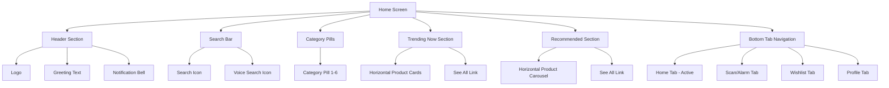

# Design Document: PricePilot Home Screen

## Overview

The PricePilot home screen is the main entry point after user authentication, featuring a modern, clean design inspired by contemporary flight booking apps. The screen uses a whitish theme with indigo accents (#6366F1), emphasizing visual clarity and ease of navigation. The design follows minimalist principles with ample white space, rounded corners, and subtle shadows to create depth without visual clutter.

The home screen provides quick access to product search, category browsing, trending products, personalized recommendations, and bottom tab navigation to other app sections.

## Architecture



## Design System

### Color Palette

**Primary Colors**:
- **Pure White**: `#FFFFFF` - Main background
- **Indigo Primary**: `#6366F1` - Active states, primary buttons, accents
- **Indigo Dark**: `#4F46E5` - Pressed states, darker accents

**Neutral Colors**:
- **Gray 50**: `#F9FAFB` - Input backgrounds, card backgrounds
- **Gray 100**: `#F3F4F6` - Subtle borders, dividers
- **Gray 400**: `#9CA3AF` - Placeholder text, secondary icons
- **Gray 600**: `#4B5563` - Secondary text
- **Gray 900**: `#111827` - Primary text, headings

**Semantic Colors**:
- **Success Green**: `#10B981` - Price drops, positive indicators
- **Warning Orange**: `#F59E0B` - Price alerts
- **Error Red**: `#EF4444` - Price increases, errors

### Typography

**Font Family**: 
- Primary: `Inter` or `SF Pro Display` (iOS native feel)
- Fallback: System default sans-serif

**Font Sizes & Weights**:
- **Heading 1**: 28px, Bold (700) - Screen titles
- **Heading 2**: 20px, SemiBold (600) - Section titles
- **Heading 3**: 16px, SemiBold (600) - Card titles
- **Body Large**: 16px, Regular (400) - Primary content
- **Body**: 14px, Regular (400) - Secondary content
- **Caption**: 12px, Regular (400) - Metadata, timestamps
- **Button Text**: 16px, SemiBold (600) - CTAs

**Line Heights**:
- Headings: 1.2x font size
- Body text: 1.5x font size
- Buttons: 1.3x font size

### Spacing System

**Base Unit**: 4px

**Spacing Scale**:
- `xs`: 4px
- `sm`: 8px
- `md`: 12px
- `base`: 16px
- `lg`: 20px
- `xl`: 24px
- `2xl`: 32px
- `3xl`: 40px
- `4xl`: 48px

**Component Spacing**:
- Screen padding: 16px (horizontal), 12px (top)
- Card padding: 16px
- Section spacing: 24px (vertical gap between sections)
- Element spacing: 12px (gap between related elements)

### Border Radius

- **Small**: 8px - Pills, tags
- **Medium**: 12px - Cards, inputs
- **Large**: 16px - Featured cards, modals
- **Full**: 9999px - Circular buttons, avatars

### Shadows

**Card Shadow** (Elevation 1):
```
shadowColor: '#000',
shadowOffset: { width: 0, height: 2 },
shadowOpacity: 0.05,
shadowRadius: 8,
elevation: 2
```

**Featured Card Shadow** (Elevation 2):
```
shadowColor: '#000',
shadowOffset: { width: 0, height: 4 },
shadowOpacity: 0.08,
shadowRadius: 12,
elevation: 4
```

**Button Shadow** (Elevation 1):
```
shadowColor: '#6366F1',
shadowOffset: { width: 0, height: 2 },
shadowOpacity: 0.15,
shadowRadius: 6,
elevation: 3
```

## Component Specifications

### 1. Header Section

**Layout**:
- Height: 60px
- Padding: 16px horizontal, 12px vertical
- Background: White
- Border bottom: 1px solid Gray 100

**Elements**:

**Logo** (Left):
- Size: 32px × 32px
- Type: Icon or text logo
- Color: Indigo Primary

**Greeting Text** (Center-Left):
- Text: "Hello, [First Name]"
- Font: Body Large, Regular
- Color: Gray 900

**Notification Bell** (Right):
- Icon: Bell outline
- Size: 24px
- Color: Gray 600
- Badge: Red dot (8px) if unread notifications exist
- Tap: Navigate to notifications screen

### 2. Search Bar

**Layout**:
- Height: 48px
- Margin: 16px horizontal, 12px top
- Background: Gray 50
- Border radius: 12px
- Border: 1px solid Gray 100

**Elements**:

**Search Icon** (Left):
- Icon: Magnifying glass
- Size: 20px
- Color: Gray 400
- Position: 12px from left edge

**Input Field** (Center):
- Placeholder: "Search products..."
- Font: Body, Regular
- Color: Gray 900
- Placeholder color: Gray 400
- Padding: 12px left of icon

**Voice Search Icon** (Right):
- Icon: Microphone
- Size: 20px
- Color: Indigo Primary
- Position: 12px from right edge
- Tap: Activate voice search

**Interaction**:
- Focus: Border changes to Indigo Primary (2px)
- Tap: Navigate to search screen with keyboard open

### 3. Category Pills

**Layout**:
- Horizontal scrollable row
- Height: 40px
- Margin: 16px top, 16px horizontal
- Gap between pills: 8px
- Show 4-5 pills on screen, scroll for more

**Individual Pill**:
- Height: 40px
- Padding: 12px horizontal
- Background: Gray 50
- Border radius: 8px
- Border: 1px solid Gray 100

**Active Pill**:
- Background: Indigo Primary
- Border: None
- Text color: White

**Inactive Pill**:
- Background: Gray 50
- Text color: Gray 600

**Pill Content**:
- Icon: 16px (optional, left of text)
- Text: Category name
- Font: Body, SemiBold
- Gap: 6px between icon and text

**Categories** (6 total):
1. Electronics
2. Fashion
3. Home & Kitchen
4. Beauty
5. Sports
6. Books

**Interaction**:
- Tap: Filter products by category
- Active state persists until another category selected
- First pill ("All") is active by default

### 4. Trending Now Section

**Layout**:
- Margin: 24px top, 16px horizontal
- Background: Transparent

**Section Header**:
- Layout: Flexbox row, space-between
- Margin bottom: 12px

**Title** (Left):
- Text: "Trending Now"
- Font: Heading 2, SemiBold
- Color: Gray 900

**See All Link** (Right):
- Text: "See all"
- Font: Body, Regular
- Color: Indigo Primary
- Icon: Chevron right (16px)
- Tap: Navigate to trending products list

**Product Cards**:
- Layout: Horizontal scrollable row
- Gap: 12px
- Card width: 160px
- Card height: 200px
- Show 2.2 cards on screen (hint at scrollability)

**Product Card Design**:

**Container**:
- Width: 160px
- Height: 200px
- Background: White
- Border radius: 12px
- Border: 1px solid Gray 100
- Shadow: Card Shadow
- Padding: 12px

**Product Image**:
- Width: 136px (full width minus padding)
- Height: 100px
- Border radius: 8px
- Object fit: Cover
- Background: Gray 50 (loading state)

**Product Name**:
- Margin top: 8px
- Font: Body, SemiBold
- Color: Gray 900
- Lines: 2 (ellipsis overflow)

**Price Row**:
- Margin top: 4px
- Layout: Flexbox row, space-between

**Current Price**:
- Font: Body Large, Bold
- Color: Gray 900

**Add Button**:
- Size: 28px × 28px
- Background: Indigo Primary
- Border radius: 8px
- Icon: Plus (16px, white)
- Shadow: Button Shadow
- Tap: Add to wishlist with haptic feedback

**Interaction**:
- Tap card: Navigate to product detail
- Tap add button: Add to wishlist (button changes to checkmark)
- Long press: Show quick actions (share, compare)

### 5. Recommended For You Section

**Layout**:
- Margin: 24px top, 16px horizontal
- Background: Transparent

**Section Header**:
- Same as Trending Now section
- Title: "Recommended for You"

**Product Carousel**:
- Layout: Horizontal scrollable row
- Gap: 16px
- Card width: 280px
- Card height: 140px
- Show 1.3 cards on screen

**Recommendation Card Design**:

**Container**:
- Width: 280px
- Height: 140px
- Background: White
- Border radius: 16px
- Border: 1px solid Gray 100
- Shadow: Featured Card Shadow
- Padding: 16px
- Layout: Flexbox row

**Product Image** (Left):
- Width: 100px
- Height: 108px (full height minus padding)
- Border radius: 12px
- Object fit: Cover

**Content Area** (Right):
- Flex: 1
- Padding left: 12px
- Layout: Flexbox column, space-between

**Product Name**:
- Font: Heading 3, SemiBold
- Color: Gray 900
- Lines: 2 (ellipsis overflow)

**Store Name**:
- Margin top: 4px
- Font: Caption, Regular
- Color: Gray 400

**Price Row**:
- Margin top: auto (push to bottom)
- Layout: Flexbox row, space-between, align-center

**Price Info**:
- Current Price: Body Large, Bold, Gray 900
- Original Price: Caption, Regular, Gray 400, strikethrough
- Discount Badge: "20% OFF" - Caption, SemiBold, Success Green

**Wishlist Button**:
- Size: 32px × 32px
- Background: Gray 50
- Border radius: 8px
- Icon: Heart outline (20px, Gray 600)
- Active: Heart filled (Indigo Primary)

**Interaction**:
- Tap card: Navigate to product detail
- Tap wishlist: Toggle wishlist status
- Swipe: Navigate through recommendations

### 6. Bottom Tab Navigation

**Layout**:
- Height: 64px (56px content + 8px safe area)
- Background: White
- Border top: 1px solid Gray 100
- Shadow: Inverted card shadow (top shadow)
- Position: Fixed bottom

**Tab Items** (4 total):
- Width: 25% of screen width
- Layout: Flexbox column, center-aligned
- Gap: 4px between icon and label

**Tab 1: Home** (Active):
- Icon: Home filled (24px)
- Label: "Home"
- Icon color: Indigo Primary
- Label color: Indigo Primary
- Font: Caption, SemiBold
- Background indicator: Indigo Primary pill (40px wide, 4px tall, 2px radius) above icon

**Tab 2: Scan/Alarm**:
- Icon: QR code scanner or bell (24px)
- Label: "Scan" or "Alarm"
- Icon color: Gray 400
- Label color: Gray 600
- Font: Caption, Regular

**Tab 3: Wishlist**:
- Icon: Heart outline (24px)
- Label: "Wishlist"
- Icon color: Gray 400
- Label color: Gray 600
- Font: Caption, Regular
- Badge: Count badge (if items > 0)

**Tab 4: Profile**:
- Icon: User circle (24px)
- Label: "Profile"
- Icon color: Gray 400
- Label color: Gray 600
- Font: Caption, Regular

**Interaction**:
- Tap: Navigate to respective screen
- Active tab: Icon and label change to Indigo Primary, indicator appears
- Haptic feedback on tap

## Screen States

### Loading State

**Initial Load**:
- Show skeleton screens for product cards
- Skeleton: Gray 100 background with animated shimmer
- Header and search bar load immediately
- Categories load after 200ms
- Product sections load progressively

**Skeleton Card** (Trending):
- Same dimensions as product card
- Animated gradient shimmer (Gray 100 → Gray 50 → Gray 100)
- Animation duration: 1.5s, infinite loop

### Empty State

**No Trending Products**:
- Icon: Trending up (48px, Gray 400)
- Title: "No trending products yet"
- Subtitle: "Check back soon for popular items"
- Font: Body, Regular, Gray 600

**No Recommendations**:
- Icon: Sparkles (48px, Gray 400)
- Title: "Building your recommendations"
- Subtitle: "Browse products to get personalized suggestions"
- CTA Button: "Explore Products" (Indigo Primary)

### Error State

**Network Error**:
- Icon: Wifi off (48px, Gray 400)
- Title: "Connection lost"
- Subtitle: "Check your internet and try again"
- CTA Button: "Retry" (Indigo Primary)

**Server Error**:
- Icon: Alert circle (48px, Error Red)
- Title: "Something went wrong"
- Subtitle: "We're working on it. Please try again later"
- CTA Button: "Retry" (Indigo Primary)

### Pull to Refresh

**Interaction**:
- Pull down from top of scroll view
- Show loading spinner (Indigo Primary)
- Refresh all sections
- Haptic feedback on trigger

## Interactions & Animations

### Scroll Behavior

**Header**:
- Fixed position, always visible
- Subtle shadow appears when scrolled (opacity 0 → 0.1)

**Search Bar**:
- Scrolls with content
- Option: Sticky after scrolling past header (future enhancement)

**Categories**:
- Horizontal scroll, momentum enabled
- Snap to nearest pill (optional)

**Product Sections**:
- Vertical scroll, momentum enabled
- Horizontal scroll within each section
- Nested scroll handling

### Tap Animations

**Cards**:
- Scale down to 0.98 on press
- Scale back to 1.0 on release
- Duration: 150ms, easing: ease-out

**Buttons**:
- Opacity 1.0 → 0.7 on press
- Duration: 100ms

**Add to Wishlist**:
- Icon scale: 1.0 → 1.2 → 1.0
- Color change: Gray → Indigo
- Duration: 300ms, easing: spring

### Transitions

**Screen Navigation**:
- Slide from right (iOS standard)
- Duration: 300ms
- Easing: ease-in-out

**Tab Navigation**:
- Fade transition
- Duration: 200ms

## Accessibility

### Screen Reader Support

**Header**:
- Logo: "PricePilot logo"
- Greeting: "Hello, [Name]"
- Notification: "Notifications, [count] unread" or "Notifications"

**Search Bar**:
- Label: "Search products"
- Hint: "Tap to search for products by name or category"
- Voice button: "Voice search"

**Category Pills**:
- Label: "[Category name] category"
- State: "Selected" or "Not selected"

**Product Cards**:
- Label: "[Product name], [Price], [Store name]"
- Add button: "Add [Product name] to wishlist"

**Tab Navigation**:
- Label: "[Tab name] tab"
- State: "Selected" or "Not selected"

### Touch Targets

**Minimum Size**: 44px × 44px (iOS HIG standard)

**Components**:
- Notification bell: 44px × 44px
- Search bar: 48px height (full width)
- Category pills: 40px height, min 60px width
- Product cards: 160px × 200px (full card tappable)
- Add buttons: 44px × 44px (increased from 28px visual)
- Tab items: Full width × 64px height

### Color Contrast

**WCAG AA Compliance**:
- Gray 900 on White: 16.1:1 (AAA)
- Gray 600 on White: 7.2:1 (AA)
- Indigo Primary on White: 4.8:1 (AA)
- White on Indigo Primary: 4.8:1 (AA)

## Data Requirements

### API Endpoints

**GET /products/trending**:
- Query params: `limit` (default: 10)
- Response: Array of product objects
- Cache: 5 minutes

**GET /products/recommended**:
- Query params: `user_id`, `limit` (default: 10)
- Response: Array of product objects with recommendation score
- Cache: 15 minutes

**GET /categories**:
- Response: Array of category objects
- Cache: 1 hour

**POST /wishlist/add**:
- Body: `{ product_id: string }`
- Response: Success status
- Auth: Required

### Product Object Schema

```typescript
interface Product {
  id: string;
  name: string;
  price: number;
  originalPrice?: number;
  discount?: number;
  imageUrl: string;
  store: string;
  category: string;
  inWishlist: boolean;
  trending?: boolean;
  trendingRank?: number;
}
```

### Category Object Schema

```typescript
interface Category {
  id: string;
  name: string;
  icon?: string;
  productCount: number;
}
```

## Performance Considerations

### Image Optimization

**Product Images**:
- Format: WebP with JPEG fallback
- Sizes: 
  - Thumbnail: 320px width (trending cards)
  - Medium: 640px width (recommended cards)
- Lazy loading: Load images as they enter viewport
- Placeholder: Gray 50 background with shimmer

### List Optimization

**FlatList Configuration**:
- `initialNumToRender`: 6
- `maxToRenderPerBatch`: 5
- `windowSize`: 10
- `removeClippedSubviews`: true (Android)
- `getItemLayout`: Provide for fixed-height items

**Horizontal Scrolls**:
- Render all items (max 10 per section)
- Use `ScrollView` instead of `FlatList` for small lists

### State Management

**Local State**:
- Category selection
- Wishlist toggle (optimistic update)
- Scroll position

**Global State** (Context/Redux):
- User data
- Wishlist items
- Cart items

**Server State** (React Query/SWR):
- Trending products
- Recommended products
- Categories

### Caching Strategy

**Memory Cache**:
- Product images: 50MB limit
- API responses: 10MB limit

**Disk Cache**:
- Product images: 200MB limit
- Expire after 7 days

## Error Handling

### Network Errors

**Scenario**: API request fails
**Handling**:
1. Show error state in affected section
2. Keep other sections functional
3. Provide retry button
4. Log error to analytics

### Image Load Errors

**Scenario**: Product image fails to load
**Handling**:
1. Show placeholder with product icon
2. Retry once after 2 seconds
3. If retry fails, keep placeholder

### Wishlist Errors

**Scenario**: Add to wishlist fails
**Handling**:
1. Revert optimistic update
2. Show toast: "Couldn't add to wishlist. Try again."
3. Provide retry option in toast

## Testing Strategy

### Unit Tests

**Components**:
- Header renders correctly
- Search bar handles input
- Category pills toggle active state
- Product cards display data correctly
- Tab navigation highlights active tab

**Utilities**:
- Price formatting
- Date formatting
- Image URL generation

### Integration Tests

**User Flows**:
1. Load home screen → See trending products
2. Tap category → Filter products
3. Tap product card → Navigate to detail
4. Add to wishlist → Update UI
5. Tap tab → Navigate to screen

### Visual Regression Tests

**Snapshots**:
- Home screen (default state)
- Home screen (loading state)
- Home screen (error state)
- Home screen (empty state)
- Product card variations

### Accessibility Tests

**Checks**:
- Screen reader labels present
- Touch targets meet minimum size
- Color contrast meets WCAG AA
- Focus order is logical

## Correctness Properties

### Property 1: Visual Consistency

**Statement**: ∀ component ∈ HomeScreen, component.colors ∈ DesignSystem.colors ∧ component.typography ∈ DesignSystem.typography ∧ component.spacing ∈ DesignSystem.spacing

**Verification**: All components use design system tokens, no hardcoded values

### Property 2: Accessibility Compliance

**Statement**: ∀ interactive_element ∈ HomeScreen, interactive_element.touchTarget ≥ 44px × 44px ∧ interactive_element.contrast ≥ 4.5:1 ∧ interactive_element.screenReaderLabel ≠ null

**Verification**: All interactive elements meet accessibility standards

### Property 3: Performance Targets

**Statement**: HomeScreen.initialLoadTime ≤ 2s ∧ HomeScreen.imageLoadTime ≤ 1s ∧ HomeScreen.scrollFPS ≥ 55

**Verification**: Performance metrics measured with React Native Performance Monitor

### Property 4: Data Integrity

**Statement**: ∀ product ∈ TrendingProducts ∪ RecommendedProducts, product.id ≠ null ∧ product.price > 0 ∧ product.imageUrl ≠ null

**Verification**: API responses validated with Zod schemas before rendering

### Property 5: State Synchronization

**Statement**: ∀ product ∈ HomeScreen, product.inWishlist = WishlistState.includes(product.id)

**Verification**: Wishlist state synced across all product displays, optimistic updates revert on error

## Future Enhancements

### Phase 2 Features

1. **Search Suggestions**: Show recent searches and popular queries
2. **Category Icons**: Add custom icons for each category
3. **Price Alerts**: Show badge on products with active price alerts
4. **Personalized Banners**: Featured deals based on user preferences
5. **Quick Actions**: Long press for share, compare, add to cart

### Phase 3 Features

1. **AR Product Preview**: View products in augmented reality
2. **Voice Search**: Natural language product search
3. **Smart Filters**: AI-powered product filtering
4. **Social Features**: See what friends are buying
5. **Gamification**: Badges, streaks, rewards for engagement

## Design Reference

The design is inspired by modern flight booking apps with emphasis on:
- **Clean minimalist layout** with ample white space
- **Rounded corners** (12-16px) for friendly, approachable feel
- **Subtle shadows** for depth without heaviness
- **Indigo accent color** for consistency with auth screens
- **Large, readable typography** with clear hierarchy
- **Horizontal scrolling sections** for content discovery
- **Bottom tab navigation** for easy one-handed use

Key design principles from [modern travel app UX](https://uxtbe.medium.com/best-practices-for-ux-design-in-the-travel-industry-a033968a3bd0):
- Minimalist design prevents visual overload
- Content (product images, prices) is the main focus
- Clear visual hierarchy guides user attention
- Consistent spacing creates rhythm and flow
