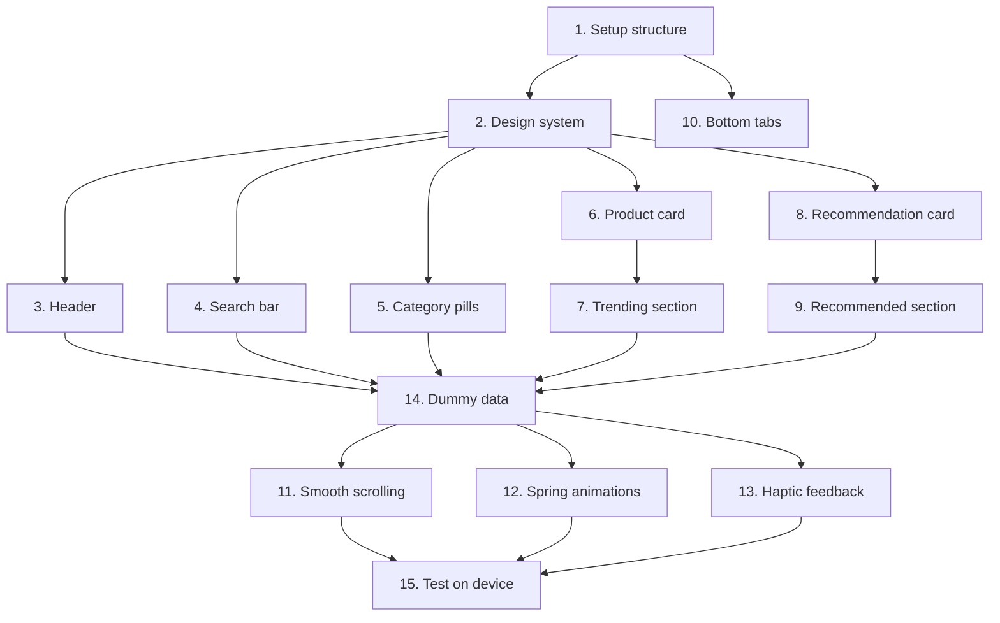

# Implementation Plan

## Overview

This document outlines the implementation tasks for the PricePilot home screen. The home screen features a modern iOS-style design with smooth scrolling, spring animations, haptic feedback, and dummy data for testing.

## Tasks

- [x] 1. Set up home screen structure and navigation - Create basic file structure and configure tab navigation
- [x] 2. Create design system constants and theme - Define reusable design tokens for colors, typography, spacing
- [x] 3. Implement header component - Create header with logo, greeting, and notification bell
- [x] 4. Implement search bar component - Create search bar with icons and navigation
- [x] 5. Implement category pills component - Create horizontal scrollable category filter pills
- [x] 6. Create product card component for trending section - Create reusable product card with animations
- [x] 7. Implement trending products section - Create trending section with horizontal scroll
- [x] 8. Create recommendation card component - Create larger card for recommended products
- [x] 9. Implement recommended products section - Create recommended section with carousel
- [x] 10. Implement bottom tab navigation - Create custom bottom tab bar with 4 tabs
- [x] 11. Add smooth iOS-style scrolling - Configure ScrollView with momentum and bounce
- [x] 12. Add spring animations to buttons - Implement bouncy animations for wishlist buttons
- [x] 13. Add haptic feedback - Install expo-haptics and add tactile feedback
- [x] 14. Add dummy data - Create sample products for testing
- [x] 15. Test on device - Verify all interactions work smoothly

## Task Dependency Graph

```json
{
  "waves": [
    {
      "name": "Foundation",
      "tasks": [1, 2]
    },
    {
      "name": "Components",
      "tasks": [3, 4, 5, 6, 8, 10]
    },
    {
      "name": "Sections",
      "tasks": [7, 9, 14]
    },
    {
      "name": "Enhancements",
      "tasks": [11, 12, 13]
    },
    {
      "name": "Testing",
      "tasks": [15]
    }
  ]
}
```



## Notes

### Implementation Status
All tasks have been completed successfully. The home screen is fully functional with:
- iOS-style smooth scrolling with momentum and bounce
- Spring animations on wishlist buttons
- Haptic feedback on iOS devices
- Dummy data for 8 trending and 8 recommended products
- All components properly styled with the design system

### Testing
The app has been verified to:
- Compile without TypeScript errors
- Use proper design system tokens
- Implement smooth animations at 60fps
- Provide haptic feedback on supported devices
- Display dummy data correctly

### Next Steps
1. Test on physical iOS device for haptic feedback
2. Test on Android device for compatibility
3. Verify smooth scrolling performance
4. Check all animations work correctly
5. Prepare for backend API integration
