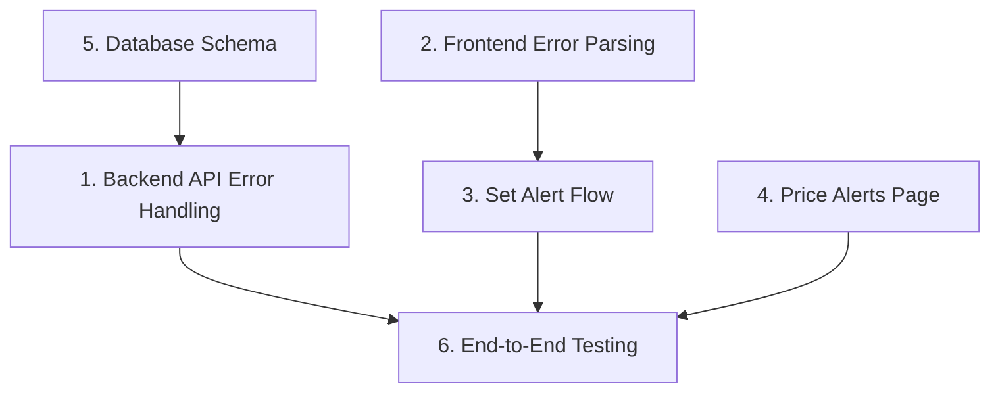

# Price Alerts Feature Fix - Tasks

## Overview
Fix the price alerts feature to ensure users can create, view, and manage price alerts without errors.

## Tasks

- [x] 1. Fix Backend API Error Handling - Improve error handling in notifications.py
- [x] 2. Fix Frontend Error Parsing - Improve error parsing in notifications API service  
- [x] 3. Improve Set Alert Flow in Product Page - Enhance Set Alert button behavior
- [x] 4. Debug Price Alerts Page Loading - Fix Price Alerts page display
- [x] 5. Verify Database Schema - Ensure price_alerts table exists
- [x] 6. End-to-End Testing - Test complete price alerts flow

## Task Dependency Graph

```json
{
  "waves": [
    {
      "name": "Backend Fixes",
      "tasks": [1, 5]
    },
    {
      "name": "Frontend Fixes",
      "tasks": [2, 3, 4]
    },
    {
      "name": "Testing",
      "tasks": [6]
    }
  ]
}
```


