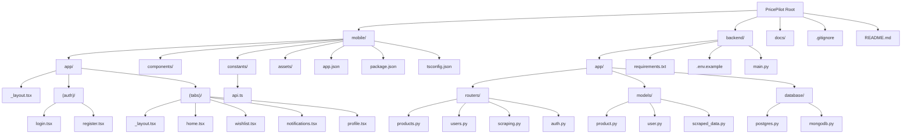

# Design Document: PricePilot Folder Structure

## Overview

PricePilot is a price comparison application with a React Native mobile frontend (using Expo Router) and FastAPI Python backend. The project uses a simple, beginner-friendly folder structure that separates mobile and backend concerns while maintaining clarity and ease of navigation. The mobile app uses Expo Router's file-based routing system for navigation. The backend follows a straightforward pattern with routers, models, and database modules without the complexity of service layers or separate configuration files.

The architecture emphasizes simplicity and educational value, making it easy to explain to instructors while maintaining professional organization standards.

## Architecture



## Components and Interfaces

### Mobile Structure (React Native + Expo Router + TypeScript)

#### Component: app/

**Purpose**: File-based routing directory using Expo Router - each file automatically becomes a route

**Structure**:
```
app/
├── _layout.tsx              # Root layout component
├── (auth)/                  # Authentication group (not in URL)
│   ├── login.tsx           # Login screen (/login)
│   └── register.tsx        # Register screen (/register)
└── (tabs)/                 # Tab navigation group (not in URL)
    ├── _layout.tsx         # Tab layout configuration
    ├── home.tsx            # Home tab (/)
    ├── wishlist.tsx        # Wishlist tab (/wishlist)
    ├── notifications.tsx   # Notifications tab (/notifications)
    └── profile.tsx         # Profile tab (/profile)
```

**Responsibilities**:
- Define app navigation structure through file system
- Organize screens by feature groups
- Handle route-based navigation automatically

**Key Concepts**:
- Files in `app/` directory automatically become routes
- Folders with `()` are route groups (don't appear in URL)
- `_layout.tsx` files define layout for their directory level
- No separate navigation configuration needed

#### Component: components/

**Purpose**: Reusable UI components used across multiple screens

**Example Files**:
- `ProductCard.tsx` - Display product information
- `PriceChart.tsx` - Visualize price history
- `SearchBar.tsx` - Search input component
- `LoadingSpinner.tsx` - Loading indicator
- `TabBarIcon.tsx` - Custom tab bar icons

#### Component: constants/

**Purpose**: Application-wide constants and configuration

**Files**:
- `api.ts` - API base URL, endpoints, and HTTP client configuration (Axios/fetch)

**Example**:
```typescript
// constants/api.ts
import axios from 'axios';

export const API_BASE_URL = process.env.EXPO_PUBLIC_API_URL || 'http://localhost:8000';

export const api = axios.create({
  baseURL: API_BASE_URL,
  timeout: 10000,
  headers: {
    'Content-Type': 'application/json',
  },
});

// API endpoints
export const endpoints = {
  products: '/products',
  users: '/users',
  auth: {
    login: '/auth/login',
    register: '/auth/register',
  },
};
```

**Responsibilities**:
- Centralize API configuration
- Define API endpoints
- Configure HTTP client
- Store app-wide constants

### Backend Structure (FastAPI + Python)

#### Component: app/routers/

**Purpose**: API endpoint definitions organized by resource

**Interface**:
```python
# routers/products.py
from fastapi import APIRouter, Depends
from typing import List

router = APIRouter(prefix="/products", tags=["products"])

@router.get("/", response_model=List[ProductResponse])
async def get_products(skip: int = 0, limit: int = 10):
    """Get list of products with pagination"""
    pass

@router.get("/{product_id}", response_model=ProductResponse)
async def get_product(product_id: int):
    """Get single product by ID"""
    pass

@router.post("/", response_model=ProductResponse)
async def create_product(product: ProductCreate):
    """Create new product"""
    pass
```

**Responsibilities**:
- Define API endpoints
- Handle HTTP requests and responses
- Validate input data
- Call database operations directly (no service layer)
- Handle authentication and authorization

**Files**:
- `products.py` - Product CRUD endpoints
- `users.py` - User management endpoints
- `scraping.py` - Web scraping trigger endpoints
- `auth.py` - Authentication endpoints (login, register, token refresh) with JWT handling

#### Component: app/models/

**Purpose**: Pydantic models for data validation and SQLAlchemy models for database

**Interface**:
```python
# models/product.py
from pydantic import BaseModel
from sqlalchemy import Column, Integer, String, Float, DateTime
from app.database.postgres import Base

# SQLAlchemy model (database)
class ProductDB(Base):
    __tablename__ = "products"
    
    id = Column(Integer, primary_key=True, index=True)
    name = Column(String, index=True)
    price = Column(Float)
    url = Column(String)
    store = Column(String)
    created_at = Column(DateTime)

# Pydantic models (validation)
class ProductBase(BaseModel):
    name: str
    price: float
    url: str
    store: str

class ProductCreate(ProductBase):
    pass

class ProductResponse(ProductBase):
    id: int
    created_at: datetime
    
    class Config:
        from_attributes = True
```

**Responsibilities**:
- Define database table schemas (SQLAlchemy)
- Define request/response schemas (Pydantic)
- Provide data validation

**Files**:
- `product.py` - Product models
- `user.py` - User models
- `scraped_data.py` - Raw scraped data models (MongoDB)

#### Component: app/database/

**Purpose**: Database connection and session management

**Interface**:
```python
# database/postgres.py
from sqlalchemy import create_engine
from sqlalchemy.ext.declarative import declarative_base
from sqlalchemy.orm import sessionmaker
import os
from dotenv import load_dotenv

load_dotenv()

POSTGRES_URL = os.getenv("POSTGRES_URL")
engine = create_engine(POSTGRES_URL)
SessionLocal = sessionmaker(autocommit=False, autoflush=False, bind=engine)
Base = declarative_base()

def get_db():
    """Dependency for database sessions"""
    db = SessionLocal()
    try:
        yield db
    finally:
        db.close()
```

```python
# database/mongodb.py
from pymongo import MongoClient
import os
from dotenv import load_dotenv

load_dotenv()

MONGODB_URL = os.getenv("MONGODB_URL")
MONGODB_DATABASE = os.getenv("MONGODB_DATABASE", "pricepilot")

client = MongoClient(MONGODB_URL)
db = client[MONGODB_DATABASE]

def get_mongo_db():
    """Get MongoDB database instance"""
    return db
```

**Responsibilities**:
- Establish database connections
- Load environment variables using python-dotenv
- Provide session/connection dependencies
- Manage connection pooling

**Files**:
- `postgres.py` - PostgreSQL (Supabase) connection with environment variable loading
- `mongodb.py` - MongoDB Atlas connection with environment variable loading

#### Component: app/routers/auth.py

**Purpose**: JWT authentication and authorization endpoints

**Interface**:
```python
# routers/auth.py
from fastapi import APIRouter, Depends, HTTPException, status
from fastapi.security import HTTPBearer, HTTPAuthCredentials
from jose import jwt, JWTError
from datetime import datetime, timedelta
from passlib.context import CryptContext
import os
from dotenv import load_dotenv

load_dotenv()

router = APIRouter(prefix="/auth", tags=["authentication"])
security = HTTPBearer()
pwd_context = CryptContext(schemes=["bcrypt"], deprecated="auto")

SECRET_KEY = os.getenv("SECRET_KEY")
ALGORITHM = os.getenv("ALGORITHM", "HS256")
ACCESS_TOKEN_EXPIRE_MINUTES = int(os.getenv("ACCESS_TOKEN_EXPIRE_MINUTES", "30"))

def create_access_token(data: dict) -> str:
    """Create JWT access token"""
    to_encode = data.copy()
    expire = datetime.utcnow() + timedelta(minutes=ACCESS_TOKEN_EXPIRE_MINUTES)
    to_encode.update({"exp": expire})
    return jwt.encode(to_encode, SECRET_KEY, algorithm=ALGORITHM)

def verify_token(credentials: HTTPAuthCredentials = Depends(security)) -> dict:
    """Verify JWT token and return payload"""
    try:
        payload = jwt.decode(credentials.credentials, SECRET_KEY, algorithms=[ALGORITHM])
        return payload
    except JWTError:
        raise HTTPException(
            status_code=status.HTTP_401_UNAUTHORIZED,
            detail="Invalid or expired token"
        )

@router.post("/login")
async def login(credentials: LoginRequest):
    """Authenticate user and return JWT token"""
    # Verify credentials and return token
    pass

@router.post("/register")
async def register(user_data: RegisterRequest):
    """Register new user"""
    pass

@router.get("/me")
async def get_current_user(token_data: dict = Depends(verify_token)):
    """Get current authenticated user"""
    pass
```

**Responsibilities**:
- Handle user authentication (login, register)
- Generate JWT tokens
- Verify JWT tokens
- Provide authentication dependencies for protected routes
- Hash and verify passwords
- Load authentication configuration from environment variables

**Key Functions**:
- `create_access_token()` - Generate JWT tokens
- `verify_token()` - Verify and decode JWT tokens (used as FastAPI dependency)
- `login()` - Authenticate user and return token
- `register()` - Create new user account
- `get_current_user()` - Get authenticated user from token

## Data Models

### PostgreSQL (Supabase) - Structured Data

#### Product Model

```python
class ProductDB(Base):
    __tablename__ = "products"
    
    id: int                    # Primary key
    name: str                  # Product name
    price: float              # Current price
    url: str                  # Product URL
    store: str                # Store name
    image_url: str            # Product image
    category: str             # Product category
    created_at: datetime      # Creation timestamp
    updated_at: datetime      # Last update timestamp
```

**Validation Rules**:
- `name` must be non-empty string, max 255 characters
- `price` must be positive float
- `url` must be valid URL format
- `store` must be non-empty string
- `category` must be from predefined list

#### User Model

```python
class UserDB(Base):
    __tablename__ = "users"
    
    id: int                    # Primary key
    email: str                 # User email (unique)
    hashed_password: str       # Bcrypt hashed password
    full_name: str            # User's full name
    is_active: bool           # Account status
    created_at: datetime      # Registration timestamp
```

**Validation Rules**:
- `email` must be valid email format and unique
- `hashed_password` must be bcrypt hash
- `full_name` must be non-empty string
- `is_active` defaults to True

### MongoDB Atlas - Raw Scraped Data

#### ScrapedData Model

```python
class ScrapedData(BaseModel):
    _id: ObjectId              # MongoDB document ID
    product_url: str           # Source URL
    store: str                 # Store identifier
    raw_html: str             # Raw HTML content
    scraped_at: datetime      # Scraping timestamp
    parsed_data: dict         # Extracted data (flexible schema)
    status: str               # Processing status
```

**Validation Rules**:
- `product_url` must be valid URL
- `store` must be non-empty string
- `scraped_at` auto-generated on insert
- `status` must be one of: "pending", "processed", "failed"
- `parsed_data` can contain any JSON structure

## Error Handling

### Error Scenario 1: Database Connection Failure

**Condition**: PostgreSQL or MongoDB connection cannot be established
**Response**: Return HTTP 503 Service Unavailable with error message
**Recovery**: Implement retry logic with exponential backoff; log error for monitoring

### Error Scenario 2: Invalid JWT Token

**Condition**: User provides expired or malformed JWT token
**Response**: Return HTTP 401 Unauthorized with "Invalid or expired token" message
**Recovery**: Client should redirect to login screen and request new token

### Error Scenario 3: Product Not Found

**Condition**: Request for product ID that doesn't exist in database
**Response**: Return HTTP 404 Not Found with "Product not found" message
**Recovery**: Client should display appropriate error message to user

### Error Scenario 4: Validation Error

**Condition**: Request body fails Pydantic validation
**Response**: Return HTTP 422 Unprocessable Entity with detailed validation errors
**Recovery**: Client should display field-specific error messages to user

## Testing Strategy

### Unit Testing Approach

**Backend (pytest)**:
- Test each router endpoint independently
- Mock database connections
- Test model validation logic
- Test JWT token generation and verification
- Coverage goal: 80%+ for critical paths

**Frontend (Jest + React Native Testing Library)**:
- Test component rendering
- Test user interactions
- Test API service functions
- Mock API responses
- Coverage goal: 70%+ for components

### Integration Testing Approach

**Backend**:
- Test full request/response cycle with test database
- Test database operations with actual PostgreSQL and MongoDB test instances
- Test authentication flow end-to-end

**Frontend**:
- Test navigation flows
- Test API integration with mock server
- Test state management

## Performance Considerations

- **Database Indexing**: Add indexes on frequently queried fields (product name, store, user email)
- **Pagination**: Implement pagination for product lists (default 10 items per page)
- **Caching**: Consider Redis for frequently accessed data in future iterations
- **Connection Pooling**: Use SQLAlchemy connection pooling for PostgreSQL
- **Image Optimization**: Compress and resize product images before storage

## Security Considerations

- **Password Hashing**: Use bcrypt with salt for password storage
- **JWT Secret**: Store SECRET_KEY in environment variables, never commit to git
- **CORS**: Configure CORS to allow only frontend domain in production
- **Input Validation**: Use Pydantic models to validate all input data
- **SQL Injection**: Use SQLAlchemy ORM to prevent SQL injection attacks
- **Rate Limiting**: Implement rate limiting on API endpoints to prevent abuse
- **HTTPS**: Enforce HTTPS in production for all API communication

## Dependencies

### Frontend Dependencies

```json
{
  "dependencies": {
    "react": "^18.2.0",
    "react-native": "^0.72.0",
    "expo": "~49.0.0",
    "expo-router": "^2.0.0",
    "expo-status-bar": "~1.6.0",
    "axios": "^1.4.0",
    "react-native-chart-kit": "^6.12.0"
  },
  "devDependencies": {
    "@types/react": "^18.2.0",
    "@types/react-native": "^0.72.0",
    "typescript": "^5.0.0",
    "jest": "^29.0.0",
    "@testing-library/react-native": "^12.0.0"
  }
}
```

### Backend Dependencies

```
fastapi==0.104.0
uvicorn[standard]==0.24.0
sqlalchemy==2.0.23
psycopg2-binary==2.9.9
pymongo==4.6.0
python-jose[cryptography]==3.3.0
passlib[bcrypt]==1.7.4
pydantic==2.5.0
python-multipart==0.0.6
python-dotenv==1.0.0
```

## Correctness Properties

### Property 1: Folder Structure Completeness

**Statement**: ∀ required_folder ∈ {mobile/app, mobile/components, mobile/constants, backend/app/routers, backend/app/models, backend/app/database}, required_folder exists in project structure

**Verification**: All essential folders are present and properly nested

### Property 2: Separation of Concerns

**Statement**: ∀ file ∈ backend/app/routers, file contains only API endpoint definitions ∧ ∀ file ∈ backend/app/models, file contains only data models

**Verification**: No business logic in routers, no HTTP handling in models

### Property 3: Configuration Isolation

**Statement**: ∀ sensitive_config ∈ {database_url, secret_key, api_keys}, sensitive_config ∈ environment_variables ∧ sensitive_config ∉ version_control ∧ sensitive_config loaded via python-dotenv

**Verification**: All secrets in .env file, .env in .gitignore, environment variables loaded directly in database and auth modules

### Property 4: Type Safety and Routing

**Statement**: ∀ file ∈ mobile/app, file has .tsx extension ∧ TypeScript compiler validates without errors ∧ file-based routing is enforced by Expo Router

**Verification**: TypeScript configuration enforces type checking, Expo Router automatically generates routes from file structure

### Property 5: Database Separation

**Statement**: structured_data → PostgreSQL ∧ raw_scraped_data → MongoDB ∧ PostgreSQL ∩ MongoDB = ∅

**Verification**: No data duplication between databases, clear separation of concerns
