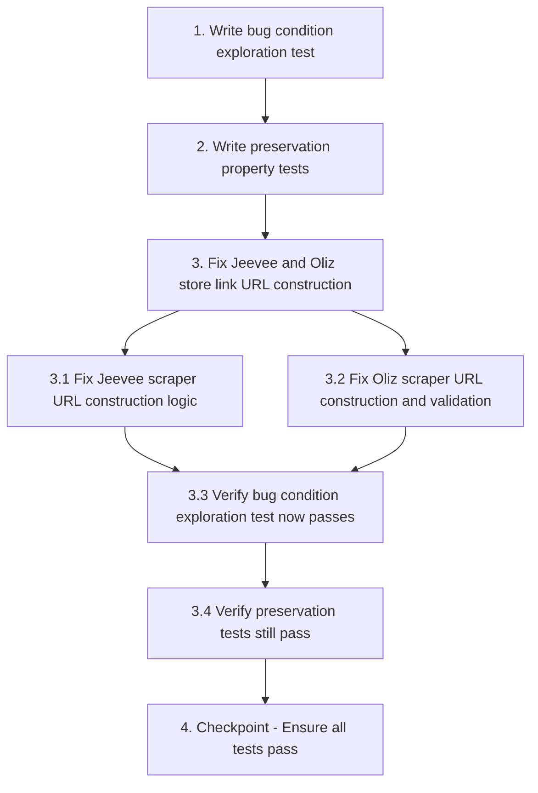

# Implementation Plan

## Overview

Fix broken store links for Jeevee (404 errors) and Oliz (403 errors) by correcting URL construction logic in the scrapers. The fix includes proper slug extraction, URL validation before storage, and comprehensive testing to ensure working stores remain unaffected.

## Tasks

- [x] 1. Write bug condition exploration test
  - **Property 1: Bug Condition** - Store Links Return HTTP Errors
  - **CRITICAL**: This test MUST FAIL on unfixed code - failure confirms the bug exists
  - **DO NOT attempt to fix the test or the code when it fails**
  - **NOTE**: This test encodes the expected behavior - it will validate the fix when it passes after implementation
  - **GOAL**: Surface counterexamples that demonstrate the bug exists
  - **Scoped PBT Approach**: For deterministic bugs, scope the property to the concrete failing case(s) to ensure reproducibility
  - Test implementation details from Bug Condition in design
  - Test that Jeevee product URLs constructed with current logic (format: `https://www.jeevee.com/products/{normalized_label}-{template_id}`) return HTTP 404 Not Found status code
  - Test that Oliz product URLs constructed with current logic (format: `https://www.olizstore.com/product/{slug}`) return HTTP 403 Forbidden status code
  - The test assertions should verify that HTTP_GET(jeevee_url).status_code == 404 AND HTTP_GET(oliz_url).status_code == 403
  - Run test on UNFIXED code
  - **EXPECTED OUTCOME**: Test FAILS (this is correct - it proves the bug exists)
  - Document counterexamples found to understand root cause (specific product URLs that fail)
  - Mark task complete when test is written, run, and failure is documented
  - _Requirements: 1.1, 1.2, 1.3, 1.4, 1.5, 1.6_

- [x] 2. Write preservation property tests (BEFORE implementing fix)
  - **Property 2: Preservation** - Non-Affected Store Links Continue Working
  - **IMPORTANT**: Follow observation-first methodology
  - Observe behavior on UNFIXED code for non-buggy inputs (Daraz, Hukut, Neostore, Hardwarepasal products)
  - Test that Daraz product URLs continue to return HTTP 200 OK status code after fix
  - Test that Hukut product URLs continue to return HTTP 200 OK status code after fix
  - Test that Neostore product URLs continue to return HTTP 200 OK status code after fix
  - Test that Hardwarepasal product URLs continue to return HTTP 200 OK status code after fix
  - Test that URL storage and retrieval preserves exact character sequences for all non-affected stores
  - Write property-based tests capturing observed behavior patterns from Preservation Requirements
  - Property-based testing generates many test cases for stronger guarantees
  - Run tests on UNFIXED code
  - **EXPECTED OUTCOME**: Tests PASS (this confirms baseline behavior to preserve)
  - Mark task complete when tests are written, run, and passing on unfixed code
  - _Requirements: 3.1, 3.2, 3.5, 3.6, 3.8, 3.9, 3.11, 3.12, 3.14, 3.15, 3.16_

- [x] 3. Fix Jeevee and Oliz store link URL construction

  - [x] 3.1 Fix Jeevee scraper URL construction logic
    - Update `c:\Users\NITOR 5\Desktop\FYP\scrapers\jeevee\jeevee_scraper.py` file
    - Modify `async_scrape_jeevee` function to properly extract and use `seo_details.slug` from API response
    - Implement fallback to label-based slug generation only when `seo_details.slug` is missing or empty
    - Improve slug normalization: lowercase, replace non-alphanumeric with hyphens, remove consecutive hyphens, strip leading/trailing hyphens
    - Ensure template_id is appended in correct format: `{slug}-{template_id}`
    - Add URL validation using HTTP HEAD request to verify constructed URLs return 200 or 3xx before storage
    - Add error handling for missing `product_template_id`, empty slugs, and malformed API responses
    - Log warnings for validation failures with product name and URL for debugging
    - _Bug_Condition: isBugCondition(input) where input.platform == "jeevee" AND HTTP_GET(input.product_url).status_code == 404_
    - _Expected_Behavior: Constructed Jeevee URLs SHALL return HTTP status 200 or 3xx when accessed_
    - _Preservation: Daraz, Hukut, Neostore, Hardwarepasal URL construction unchanged_
    - _Requirements: 2.1, 2.2, 2.3, 2.9, 2.10, 2.11, 2.12_

  - [x] 3.2 Fix Oliz scraper URL construction and validation
    - Update `c:\Users\NITOR 5\Desktop\FYP\scrapers\oliz\oliz_scraper.py` file
    - Verify and document the correct Oliz URL pattern through testing
    - Implement pre-storage URL validation for Oliz products using HTTP HEAD request with 5-second timeout
    - Only store URLs that return 200 or 3xx status codes
    - If validation fails with 403 or 404, log failure and mark URL as unavailable
    - Add retry logic to attempt alternative URL patterns if primary pattern returns 403
    - Implement robust error handling for request exceptions (timeout, connection errors, SSL errors)
    - Continue processing other products even if one URL validation fails
    - _Bug_Condition: isBugCondition(input) where input.platform == "oliz_store" AND HTTP_GET(input.product_url).status_code == 403_
    - _Expected_Behavior: Constructed Oliz URLs SHALL return HTTP status 200 or 3xx when accessed_
    - _Preservation: Daraz, Hukut, Neostore, Hardwarepasal URL construction unchanged_
    - _Requirements: 2.4, 2.5, 2.6, 2.7, 2.8_

  - [x] 3.3 Verify bug condition exploration test now passes
    - **Property 1: Expected Behavior** - Store Links Load Successfully
    - **IMPORTANT**: Re-run the SAME test from task 1 - do NOT write a new test
    - The test from task 1 encodes the expected behavior
    - When this test passes, it confirms the expected behavior is satisfied
    - Run bug condition exploration test from step 1
    - Verify Jeevee product URLs now return HTTP 200 or 3xx status codes
    - Verify Oliz product URLs now return HTTP 200 or 3xx status codes
    - **EXPECTED OUTCOME**: Test PASSES (confirms bug is fixed)
    - _Requirements: 2.1, 2.2, 2.3, 2.6, 2.7, 2.9, 2.12_

  - [x] 3.4 Verify preservation tests still pass
    - **Property 2: Preservation** - Non-Affected Store Links Continue Working
    - **IMPORTANT**: Re-run the SAME tests from task 2 - do NOT write new tests
    - Run preservation property tests from step 2
    - Verify Daraz, Hukut, Neostore, Hardwarepasal product URLs still return HTTP 200 OK
    - Verify URL storage and retrieval still preserves exact character sequences
    - **EXPECTED OUTCOME**: Tests PASS (confirms no regressions)
    - Confirm all tests still pass after fix (no regressions)
    - _Requirements: 3.1, 3.2, 3.5, 3.6, 3.8, 3.9, 3.11, 3.12, 3.14, 3.15, 3.16_

- [x] 4. Checkpoint - Ensure all tests pass
  - Ensure all tests pass, ask the user if questions arise.

## Notes

- Task 1 test MUST FAIL on unfixed code - this confirms the bug exists
- Task 2 tests MUST PASS on unfixed code - this captures baseline behavior to preserve
- After implementing the fix (task 3), task 1 test should PASS and task 2 tests should still PASS
- Use property-based testing for stronger guarantees about URL correctness across many inputs

## Task Dependency Graph

```json
{
  "waves": [
    {"wave": 1, "tasks": [1, 2]},
    {"wave": 2, "tasks": [3]}
  ]
}
```


